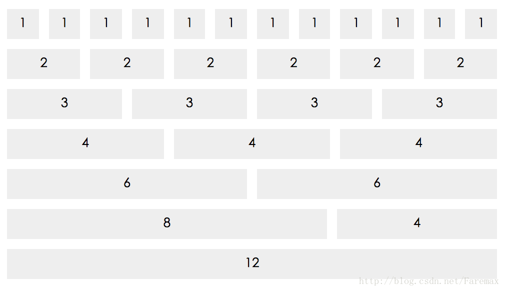

<!-- MarkdownTOC -->

- [弹性盒子基础](#%E5%BC%B9%E6%80%A7%E7%9B%92%E5%AD%90%E5%9F%BA%E7%A1%80)
  - [定义一个弹性盒子](#%E5%AE%9A%E4%B9%89%E4%B8%80%E4%B8%AA%E5%BC%B9%E6%80%A7%E7%9B%92%E5%AD%90)
  - [弹性盒子兼容情况](#%E5%BC%B9%E6%80%A7%E7%9B%92%E5%AD%90%E5%85%BC%E5%AE%B9%E6%83%85%E5%86%B5)
  - [弹性盒子概念](#%E5%BC%B9%E6%80%A7%E7%9B%92%E5%AD%90%E6%A6%82%E5%BF%B5)
  - [弹性盒子属性](#%E5%BC%B9%E6%80%A7%E7%9B%92%E5%AD%90%E5%B1%9E%E6%80%A7)
  - [子元素属性](#%E5%AD%90%E5%85%83%E7%B4%A0%E5%B1%9E%E6%80%A7)
- [多列](#%E5%A4%9A%E5%88%97)
- [实例](#%E5%AE%9E%E4%BE%8B)
  - [骰子](#%E9%AA%B0%E5%AD%90)
  - [瀑布流图](#%E7%80%91%E5%B8%83%E6%B5%81%E5%9B%BE)
  - [栅格](#%E6%A0%85%E6%A0%BC)
  - [固定底栏](#%E5%9B%BA%E5%AE%9A%E5%BA%95%E6%A0%8F)

<!-- /MarkdownTOC -->

## 弹性盒子基础

弹性盒子(Flexible Box)是css3中盒子模型的弹性布局，在传统的布局方式上增加了很多灵活性。

### 定义一个弹性盒子
在父盒子上定义display属性：
```
#box{
  display: -webkit-flex;   //webkit内核浏览器的兼容设置，下同
  display: flex;
}
```
当然还有行内布局的弹性盒子
```
#box{
  display: -webkit-inline-flex;
  display: inline-flex;
}
```
**注意，设为Flex布局以后，子元素的float、clear和vertical-align属性将失效。**

### 弹性盒子兼容情况

- Chrome 29+
- Firefox 28+
- Internet Explorer 11+
- Opera 17+
- Safari 6.1+ (prefixed with -webkit-)
- Android 4.4+
- iOS 7.1+ (prefixed with -webkit-)

### 弹性盒子概念
弹性盒子两个轴如图：
- 主轴(横轴, main axis)
- 交叉轴(纵轴, cross axis)


### 弹性盒子属性
在研究具体属性前，先建立一个基本模板，必要时修改一下部分参数：
```
<!-- html部分 -->
<div id="flex-box">
  <div class="flex-item">1</div>
  <div class="flex-item">2</div>
  <div class="flex-item">3</div>
  <div class="flex-item">4</div>
  <div class="flex-item">5</div>
</div>
<!-- css部分 -->
#flex-box{
  width: 200px;
  height: 200px;
  border: 1px solid #06f;
  display: flex;
  display: -webkit-flex;
}
.flex-item{
  height: 30px;
  width: 30px;
  color: #f00;
  font-size: 20px;
  line-height: 30px;
  text-align: center;
  background-color: #8f0;
  border: 1px solid #f00;
}
```

- flex-direction
排列方向设置
```
#flex-box{
  flex-direction: row | row-reverse | column | column-reverse;
  /* @value row 从左到右(默认)*/
  /* @value row-reverse 从右到左*/
  /* @value column 从上到下*/
  /* @value column-reverse 从下到上*/
}
```


- flex-wrap

换行设置
```
.box{
  flex-wrap: nowrap | wrap | wrap-reverse;
  /* @value nowrap 不换行(默认)*/
  /* @value wrap 换行*/
  /* @value wrap-reverse 换行 层倒序*/
}
```


- flex-flow

flex-direction和flex-wrap的缩写属性
```
.box {
  flex-flow: <flex-direction> || <flex-wrap>;
}
```

- justify-content

水平方向上对齐
```
.box {
  justify-content: flex-start | flex-end | center | space-between | space-around;
}
/* value flex-start 左对齐(默认)*/
/* value flex-end：右对齐*/
/* value center： 居中*/
/* value space-between：两端对齐，项目之间的间隔都相等*/
/* value space-around：每个项目两侧的间隔相等。所以，项目之间的间隔比项目与边框的间隔大一倍*/
```


- align-items

垂直方向上对齐
```
.box {
  align-items: flex-start | flex-end | center | baseline | stretch;
}
/* value flex-start 交叉轴的起点对齐*/
/* value flex-end 交叉轴的终点对齐*/
/* value center 交叉轴的中点对齐*/
/* value baseline 项目的第一行文字的基线对齐*/
/* value stretch 如果项目未设置高度或设为auto，将占满整个容器的高度(默认)*/
```


- align-content

多根轴线的对齐方式
```
.box {
  align-content: flex-start | flex-end | center | space-between | space-around | stretch;
}
/* value flex-start 与交叉轴的起点对齐*/
/* value flex-end 与交叉轴的终点对齐*/
/* value center 与交叉轴的中点对齐*/
/* value space-between 与交叉轴两端对齐，轴线之间的间隔平均分布*/
/* value space-around 每根轴线两侧的间隔都相等。所以，轴线之间的间隔比轴线与边框的间隔大一倍*/
/* value stretch 轴线占满整个交叉轴(默认值)*/
```


### 子元素属性

- order: 属性定义项目的排列顺序。数值越小，排列越靠前，默认为0
- flex-grow: 属性定义项目的放大比例，默认为0，即如果存在剩余空间，也不放大
- flex-shrink: 属性定义了项目的缩小比例，默认为1，即如果空间不足，该项目将缩小。
- flex-basis: 属性定义了在分配多余空间之前，项目占据的主轴空间它的默认值为auto，即项目的本来大小。
- flex: 属性是flex-grow, flex-shrink和flex-basis的简写。
- align-self: 属性允许单个项目有与其他项目不一样的对齐方式，可覆盖align-items属性。默认值为auto，表示继承父元素的align-items属性，如果没有父元素，则等同于stretch。

## 多列

- column-count 规定元素应该被分隔的列数
- column-fill 规定如何填充列
- column-gap  规定列之间的间隔
- column-rule 设置所有column-rule-*属性的简写属性
- column-rule-color 规定列之间规则的颜色
- column-rule-style 规定列之间规则的样式
- column-rule-width 规定列之间规则的宽度
- column-span 规定元素应该横跨的列数
- column-width 规定列的宽度
- columns 规定设置column-width和column-count的简写属性


## 实例
### 骰子


```
<!DOCTYPE html>
<html lang="en">
<head>
  <meta charset="UTF-8">
  <title>9 faces Dice</title>
</head>
<style>
  body{
    padding: 0;
    margin: 0;
  }
  #demo{
    display: flex;
    background-color: #444;
  }
  .dice{
    width: 90px;
    height: 90px;
    border-radius: 22px;
    margin: 20px;
    padding: 10px;
    box-sizing: border-box;
    border: 2px solid #aaa;
    background-color: #eee;

    display: flex;
    flex-direction: column;
    justify-content: space-between;
  }
  .dot{
    width: 20px;
    height: 20px;
    background-color: #222;
    border-top: 2px solid #000;
    box-sizing: border-box;
    /*box-shadow: 0px 0px 2px #000;*/
    border-radius: 20px;
  }
  .line{
    display: flex;
    justify-content: space-between;
  }

  #one{
    justify-content: center;
    align-items: center;
  }
  #two{
    align-items: center;
  }
  #three .line:nth-of-type(2){
    justify-content: center;
  }
  #three .line:nth-of-type(3){
    justify-content: flex-end;
  }
  #five .line:nth-of-type(2){
    justify-content: center;
  }
</style>
<body>
  <div id="demo">
    <div id="one" class="dice">
      <div class="line">
        <div class="dot"></div>
      </div>
    </div>
    <div id="two" class="dice">
      <div class="line">
        <div class="dot"></div>
      </div>
      <div class="line">
        <div class="dot"></div>
      </div>
    </div>
    <div id="three" class="dice">
      <div class="line">
        <div class="dot"></div>
      </div>
      <div class="line">
        <div class="dot"></div>
      </div>
      <div class="line">
        <div class="dot"></div>
      </div>
    </div>
    <div id="four" class="dice">
      <div class="line">
        <div class="dot"></div>
        <div class="dot"></div>
      </div>
      <div class="line">
        <div class="dot"></div>
        <div class="dot"></div>
      </div>
    </div>
    <div id="five" class="dice">
      <div class="line">
        <div class="dot"></div>
        <div class="dot"></div>
      </div>
      <div class="line">
        <div class="dot"></div>
      </div>
      <div class="line">
        <div class="dot"></div>
        <div class="dot"></div>
      </div>
    </div>
    <div id="six" class="dice">
      <div class="line">
        <div class="dot"></div>
        <div class="dot"></div>
      </div>
      <div class="line">
        <div class="dot"></div>
        <div class="dot"></div>
      </div>
      <div class="line">
        <div class="dot"></div>
        <div class="dot"></div>
      </div>
    </div>
    <div id="seven" class="dice">
      <div class="line">
        <div class="dot"></div>
        <div class="dot"></div>
      </div>
      <div class="line">
        <div class="dot"></div>
        <div class="dot"></div>
        <div class="dot"></div>
      </div>
      <div class="line">
        <div class="dot"></div>
        <div class="dot"></div>
      </div>
    </div>
    <div id="eight" class="dice">
      <div class="line">
        <div class="dot"></div>
        <div class="dot"></div>
        <div class="dot"></div>
      </div>
      <div class="line">
        <div class="dot"></div>
        <div class="dot"></div>
      </div>
      <div class="line">
        <div class="dot"></div>
        <div class="dot"></div>
        <div class="dot"></div>
      </div>
    </div>
    <div id="nine" class="dice">
      <div class="line">
        <div class="dot"></div>
        <div class="dot"></div>
        <div class="dot"></div>
      </div>
      <div class="line">
        <div class="dot"></div>
        <div class="dot"></div>
        <div class="dot"></div>
      </div>
      <div class="line">
        <div class="dot"></div>
        <div class="dot"></div>
        <div class="dot"></div>
      </div>
    </div>
  </div>
</body>
</html>
```

### 瀑布流图


```
<!DOCTYPE html>
<html lang="zh-CN">
<head>
  <meta charset="UTF-8">
  <title>test</title>
  <style>
  ul{
    width: 1000px;
    margin: 0 auto;
    padding: 0;
    columns: 4;
    list-style: none;
    column-gap: 2px;
    column-fill: balance;
  }
  ul li {
    margin: 4px 0;
  }
  ul li img{
    width:240px;
  }
  </style>
</head>
<body>
<ul>
  <li></li>
  <li></li>
  <li></li>
  <li></li>
  <li></li>
  <li></li>
  <li></li>
  <li></li>
  <li></li>
  <li></li>
  <li></li>
  <li></li>
  <li></li>
  <li></li>
  <li></li>
</ul>
</body>
</html>
```

### 栅格


```
<!DOCTYPE html>
<html lang="zh-CN">
<head>
  <meta charset="UTF-8">
  <title>test</title>
  <style>
  #grid-demo{
    width: 1000px;
    margin: 0 auto;
  }
  .grid{
    display: flex;
    margin: 20px 0;
    height: 60px;
  }
  .grid .grid-item{
    flex-grow: 1;
    background-color: #eee;
    height: 60px;
    line-height: 60px;
    font-size: 26px;
    width: 5%;
    text-align: center;
    margin: 0 10px;
  }
  .grid .col-10{
    flex-basis: 83.3333%
  }
  .grid .col-8{
    flex-basis: 66.6666%;
  }
  .grid .col-6{
    flex-basis: 50%;
  }
  .grid .col-4{
    flex-basis: 33.3333%;
  }
  .grid .col-3{
    flex-basis: 25%;
  }
  .grid .col-2{
    flex-basis: 16.6667%;
  }
  </style>
</head>
  <body>
  <div id="grid-demo">
    <div class="grid">
      <div class="grid-item">1</div>
      <div class="grid-item">1</div>
      <div class="grid-item">1</div>
      <div class="grid-item">1</div>
      <div class="grid-item">1</div>
      <div class="grid-item">1</div>
      <div class="grid-item">1</div>
      <div class="grid-item">1</div>
      <div class="grid-item">1</div>
      <div class="grid-item">1</div>
      <div class="grid-item">1</div>
      <div class="grid-item">1</div>
    </div>
    <div class="grid">
      <div class="grid-item">2</div>
      <div class="grid-item">2</div>
      <div class="grid-item">2</div>
      <div class="grid-item">2</div>
      <div class="grid-item">2</div>
      <div class="grid-item">2</div>
    </div>
    <div class="grid">
      <div class="grid-item">3</div>
      <div class="grid-item">3</div>
      <div class="grid-item">3</div>
      <div class="grid-item">3</div>
    </div>
    <div class="grid">
      <div class="grid-item">4</div>
      <div class="grid-item">4</div>
      <div class="grid-item">4</div>
    </div>
    <div class="grid">
      <div class="grid-item">6</div>
      <div class="grid-item">6</div>
    </div>
    <div class="grid">
      <div class="grid-item col-8">8</div>
      <div class="grid-item col-4">4</div>
    </div>
    <div class="grid">
      <div class="grid-item">12</div>
    </div>
  </div>
</body>
</html>
```

### 固定底栏


```
<!DOCTYPE html>
<html lang="zh-CN">
<head>
  <meta charset="UTF-8">
  <title>test</title>
  <style>
  body{
    margin: 0;
    padding: 0;
  }
  #demo{
    display: flex;
    flex-direction: column;
    min-height: 100vh;
  }
  header, footer{
    height: 100px;
    background-color: darkblue;
    color: white;
    text-align: center;
    line-height: 100px;
  }
  .flex-body{
    flex-grow: 1;
  }
  </style>
</head>
<body>
  <div id="demo">
    <header>I am header!</header>
    <div class="flex-body">I am body!</div>
    <footer>I am footer!</footer>
  </div>
</body>
</html>
```
