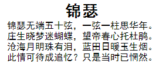
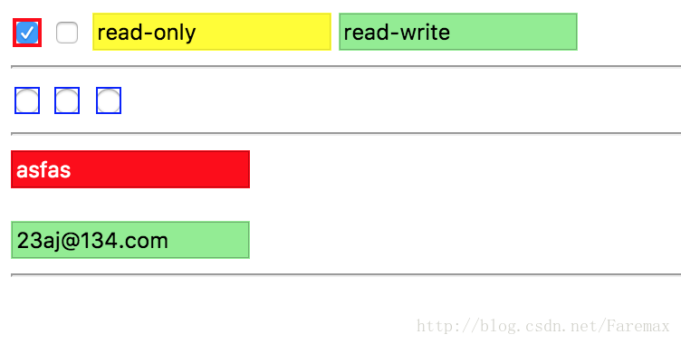

<!-- MarkdownTOC -->

- [:first-letter](#first-letter)
- [:first-line](#first-line)
- [::selection \(CSS3\)](#selection-css3)
- [:empty \(CSS3\)](#empty-css3)
- [:focus](#focus)
- [:disabled :enabled \(CSS3\)](#disabled-enabled-css3)
- [:checked :read-only :read-write :indeterminate :invalid :valid \(CSS3\)](#checked-read-only-read-write-indeterminate-invalid-valid-css3)
- [:required :optional :in-range :out-of-range :default \(CSS3\)](#required-optional-in-range-out-of-range-default-css3)
- [:link :hover :active :visited](#link-hover-active-visited)
- [:first-child :last-child :nth-child :not :only-child](#first-child-last-child-nth-child-not-only-child)
- [:first-of-type :last-of-type :nth-of-type :nth-last-of-type :only-of-type](#first-of-type-last-of-type-nth-of-type-nth-last-of-type-only-of-type)
- [:target](#target)
- [:before :after](#before-after)

<!-- /MarkdownTOC -->

既然说到伪类，这里就用足够的代码给表现一下他们的神奇用法。从简单到复杂，可以清晰的看清到伪类的诸多使用方法，对于有些功能近似的就取其一举例了：

### :first-letter

为第一个字添加样式，这里用一个首字下沉的例子来演示一下：
```
<!--html部分-->
<p>中国是以华夏文明为源泉<!--内容省略--></p>
<!--css部分-->
p:first-letter{
  display: block;
  float: left;
  margin-right: .2em;
  font-size: 1.7em;
}
```


### :first-line
为段落的第一行添加样式：
```
<!--html部分-->
<p style="text-align: center;">
锦瑟<br/>
锦瑟无端五十弦，一弦一柱思华年。<br/>
庄生晓梦迷蝴蝶，望帝春心托杜鹃。<br/>
沧海月明珠有泪，蓝田日暖玉生烟。<br/>
此情可待成追忆？只是当时已惘然。<br/>
</p>
<!--css部分-->
p:first-line{
  font-weight: bold;
  font-size: 1.7em;
}
```


### ::selection (CSS3)
设置文字被选中是的状态，还是上面那段文字：
```
<!--css部分-->
.select::selection{
  background-color: yellowgreen;
}
```


### :empty (CSS3)
内容为空的元素样式
```
<!--html部分-->
<div></div>
<div>我有内容</div>
<!--css部分-->
div{
  width: 60px;
  height: 40px;
  background-color: lightgray;
  margin: 5px;
}
div:empty{
  background-color: darkgray;
}
```


如果`<a></a>`中间没有内容，把href的值作为内容：
```
<!--html部分-->
<a href="www.baidu.com"></a>
<!--css部分-->
a:empty:before{
content: attr(href);
}
```

### :focus
当元素获得焦点时的样式
```
<!--html部分-->
<input tyle="text" />
<!--css部分-->
input[type="text"]:focus{
  border: 1px purple solid;
  box-shadow: 0 0 15px black;
}
```

### :disabled :enabled (CSS3)
被禁用元素的样式
```
<!--html部分-->
<input type="text" disabled />
<input type="text" />
<!--css部分-->
input:disabled{
  background-color: red;
}
input:enabled{
  background-color: yellow;
}
```


### :checked :read-only :read-write :indeterminate :invalid :valid (CSS3)
伪类 | 描述
--- | ---
:checked | input中选中的radio、checkbox和select
:read-only | 有readonly属性的input、select和textarea元素(firefox不支持)
:read-write | 没有readonly属性的input、select和textarea可写元素(firefox不支持)
:indeterminate | 没有任一项被选中的radio组(firefox不支持)
:invalid | input表单验证不通过的元素
:valid | input表单验证通过的元素
```
<!-- html部分 -->
<input name="multi" type="checkbox" checked />
<input name="multi" type="checkbox" />
<input type="text" readonly value="read-only" />
<input type="text" value="read-write" />
<hr>
<input type="radio" name="sel" />
<input type="radio" name="sel" />
<input type="radio" name="sel" />
<hr>
<input type="email" />
<input type="email" />

<!-- css部分 -->

input[type="checkbox"]:checked{
  outline: 2px solid red;
}
input:read-only{
  background-color: yellow;
}
input:read-write{
  background-color: lightgreen;
}
input:indeterminate{
  outline: 1px solid blue;
}
input[type="email"]:invalid{
  background-color: red;
  color: #fff;
}
input[type="email"]:valid{
  background-color: #lightgreen;
}
```



### :required :optional :in-range :out-of-range :default (CSS3)
伪类 | 描述
--- | ---
:required | 具有required属性的input、select和textarea元素
:optional | 没有required属性的可编辑的input、select和textarea元素
:in-range | 在规定范围内的合法输入
:out-of-range | 不在规定范围内的合法输入
:default | 默认样式(仅firefox支持)
```
<!-- html部分 -->
<input type="text" required />
<input type="text" />
<hr>
<input type="number" min="20" max="80" />
<input type="number" min="20" max="80" />
<hr>
<input type="range" name="range" id="range">
<!-- css部分 -->
:default{
  background-color: green;
}
input:required{
  background-color: yellow;
}
input:optional{
  background-color: orange;
}
input:in-range{
  background-color: lightgreen;
}
input:out-of-range{
  background-color: red;
  color: white;
}

input:indeterminate{
  outline: 1px solid blue;
}
```

### :link :hover :active :visited
:link 锚点的样式
:hover 鼠标浮动在元素上方时的样式(任何元素)
active 鼠标点击下去的样式(任何元素)
:visited 鼠标点击过后的颜色(任何元素)
```
<!--html部分-->
<a href="www.baidu.com">百度</a>
<!--css部分-->
a:link{
  text-decoration: none;
  font-weight: bold;
  color: black;
}
a:hover{
  text-decoration: underline;
  color: blue;
}
a:active{
  text-decoration: none;
  color: purple;
}
a:visited{
  text-decoration: none;
  color: darkgray;
}
```


### :first-child :last-child :nth-child :not :only-child
:first-child 第一个元素样式
:last-child 最后一个元素样式
:nth-child(n) 第n个元素样式(这个还能玩出花样的)
:not(selector) 不符合selector选择器的样式
```
<!--html部分省略，一个10元素的ul，其中第四个li的name属性为except-->
<!--css部分-->
ul li{
  list-style: none;
  background-color: skyblue;
  color: white;
  text-align: center;
  width: 100px;
  height: 20px;
  margin: 5px auto;
  float: left;
}
ul li:first-child{
  color: blue;
}
ul li:last-child{
  color: red;
}
ul li:nth-child(3){
  color: darkgreen;
}
ul li:not([name="except"]){
  font-style: italic;
}
```

```
<!--css部分-->
/*下面实现偶数部分样式变化*/
ul li:nth-child(2n){  /*2n+1可以表示奇数的*/
  background-color: blue;
}
```

```
<!--css部分-->
/*下面实现连续部分样式变化*/
ul li:nth-child(n+3):nth-child(-n+8){
  background-color: blue;
}
/*
:nth-child(n+3)表示第三个以后的元素
:nth-child(-n+8)表示第8个以前的元素
因此这里选择了选择第三到第八的元素
*/
```


:only-child 放在下一节和:only-of-type比较讲解
### :first-of-type :last-of-type :nth-of-type :nth-last-of-type :only-of-type
此外CSS3中:first-of-type :last-of-type :nth-of-type(n) :nth-last-of-type(n)用法与上述相似，作用也一致，其中:nth-last-of-type(n)表示倒数第n个元素。type和child的两种具有以下差别：

```
//伪代码
<!-- html部分 -->
<div>
<div>
  <h3>div1中的唯一子元素h3</h3>     <!-- 这个是h3:only-child -->
</div>
<div>
  <h3>div2中的第1个h3</h3>
  <h4>div2中的第1个h4</h4>     <!-- 这个是h4:only-of-type -->
  <h3>div2中的第2个h3</h3>
</div>
<div>
  <h3>div3中的第1个h3</h3>   <!-- 这个是h3:nth-of-type(1) 是 h3:nth-child(1) -->
  <h4>div3中的第1个h4</h4>   <!-- 这个是h4:nth-of-type(1) 是 h4:nth-child(2) -->
  <h3>div3中的第2个h3</h3>   <!-- 这个是h3:nth-of-type(2) 是 h3:nth-child(3) -->
  <h4>div3中的第2个h4</h4>   <!-- 这个是h3:nth-of-type(2) 是 h4:nth-child(4) -->
  <h3>div3中的第3个h3</h3>   <!-- 这个是h3:nth-of-type(3) 是 h3:nth-child(5) -->
  <h4>div3中的第3个h4</h4>   <!-- 这个是h3:nth-of-type(4) 是 h4:nth-child(6) -->
</div>
<!-- css部分 -->
h3:nth-of-type(2){
  color: #00f;
}
h4:nth-child(4){
  color: #ff0;
}
h4:only-of-type{
  background-color: #ff0;
}
h3:only-child{
  background-color: #f0f;
}
```
上面例子中还有 :only-child和CSS3中的:only-of-type两个伪类，表示单独的元素，也就是前后没有与之相同的元素。具体效果见下图：


### :target
:target 选择器可用于选取当前活动的目标元素(即url中的锚元素)。
下面用target做一个选项卡的样式（点击切换）
```
<!--html部分-->
<div id="tab">
  <nav class="title">
    <a href="#a">标签一</a>
    <a href="#b">标签二</a>
    <a href="#c">标签三</a>
  </nav>
  <ul class="content">
    <li id="a">内容一</li>
    <li id="b">内容二</li>
    <li id="c">内容三</li>
  </ul>
</div>
<!--css部分-->
#tab .title a{
  float: left;
  text-decoration: none;
  width: 100px;
  height: 35px;
  line-height: 35px;
  text-align: center;
  border:1px solid black;
}
#tab .title a:nth-child(n+2){
  border-left:none;
}
#tab .content{
  clear:both;
  position:relative;
}
#tab .content li{
  width:302px;
  height:300px;
  border:1px solid black;
  border-top: none;
  background-color: white;
  position:absolute;
  left:0;
  top:0;
}
#tab .content li:target{
  z-index:1;
}
```

### :before :after
这个是最值得一提的，在元素的前后添加内容，当然也可以添加一个块元素，这个块变化就无穷了，下面举几个例子：

- 首当其冲的就是清除浮动了
```
<!--html部分-->
<div class="clr">
  <div class="float">1</div>
  <div class="float">2</div>
</div>
<div class="float">3</div>
<div class="float">4</div>
<!--css部分-->
*{
  margin:0;
  padding:0;
}
.float{
  width: 40px;
  height: 40px;
  background-color: blue;
  margin: 5px;
  float: left;
  color: yellow;
}
.clr:after{
  content: "";
  clear: both;
  overflow: hidden;
  height: 0;
  display: block;
}
```


- 自动计数
```
<!-- html部分 -->
<h3>hello</h3>
  <h4>world!</h4>
  <h4>world!</h4>
  <h4>world!</h4>
  <h4>world!</h4>
  <h4>world!</h4>
<h3>hello</h3>
  <h4>world!</h4>
  <h4>world!</h4>
  <h4>world!</h4>
  <h4>world!</h4>
  <h4>world!</h4>
<!-- css部分 -->
h3{
  counter-increment: myNumH3;
  counter-reset: myNumH4;
}
h3:before{
  content: '第'counter(myNumH3)'章 ';
  color: #08f;
}
h4{
  counter-increment: myNumH4;
  margin-left: 20px;
}
h4:before{
  content: '第'counter(myNumH3)'-'counter(myNumH4)'节 ';
  color: #00f;
}
```


- 图片右上角标签:
```
<!--html部分-->
<div class="new"><span>new</span></div>
<!--css部分-->
.new,img{
  width: 300px;
  height: 200px;
}
.new span{
  position: relative;
  display: block;
  letter-spacing: 2px;
  font-size:20px;
  width:30px;
  height:20px;
  color: white;
  top: -190px;
  left: 262px;
  z-index:1;
  transform: rotate(45deg);
}
.new:after{
  content:"";
  display:block;
  font-size:20px;
  width: 0;
  height: 0;
  border:solid 35px transparent;
  border-top-color: red;
  border-right-color: red;
  position:relative;
  top: -224px;
  left: 230px;
}
```


- 按钮点击范围扩大:
```
<!--html部分-->
<div class="enlarge button">按钮</div>
<!--css部分-->
.button{
  width:80px;
  height: 40px;
  border:2px solid dimgray;
  background-color: dodgerblue;
  color: #202020;
  text-align: center;
  line-height: 40px;
  font-size: 20px;
  margin:20px;
}
.enlarge:after{
  content:"";
  display: block;
  height: 60px;
  width: 100px;
  position: relative;
  top: -50px;
  left: -10px;
  background-color: rgba(100, 100, 100, 0.4);/*用颜色表示一下区域,应该透明*/
}
```


- 按钮右上角提示:
```
<!--html部分-->
<div class="cor_num button" data-num="8">按钮</div>
<!--css部分-->
.cor_num:after{
  content: attr(data-num);
  padding:0;
  line-height: 22px;
  position: relative;
  display: block;
  background-color: red;
  top: -50px;
  left: 68px;
  width: 24px;
  height: 24px;
  border-radius: 12px;
  color: white;
  font-size:14px;
}
```


- 对话框样式
```
<!--html部分-->
<div class="dialog">这是一个对话框</div>
<!--css部分-->
.dialog{
  background-color: pink;
  border: 2px solid gray;
  text-align: center;
  line-height: 80px;
  width: 150px;
  height: 80px;
  margin-bottom: 40px;
}
.dialog:after{
  content:"";
  display: block;
  background: inherit;
  border: inherit;
  border-top: 0;
  border-left: 0;
  position: relative;
  width:30px;
  height: 30px;
  top: -15px;
  left: 20px;
  transform: rotate(45deg);
}
```


- 一个福，我自己写着玩的
```
<!--html部分-->
<div class="luck"><span>福</span></div>
<!--css部分-->
.luck{
  float: left;
  width: 100px;
  height: 100px;
  margin:30px;
  margin-bottom: 45px;
}
.luck span{
  color: gold;
  position: relative;
  font-size: 4em;
  width:70px;
  height: 70px;
  transform: rotate(180deg);
  display: block;
  top: -80px;
  left: 16px;
}
.luck:before{
  content:"";
  display:block;
  width: 100px;
  height: 100px;
  background-color: red;
  transform: rotate(45deg);
}
```

