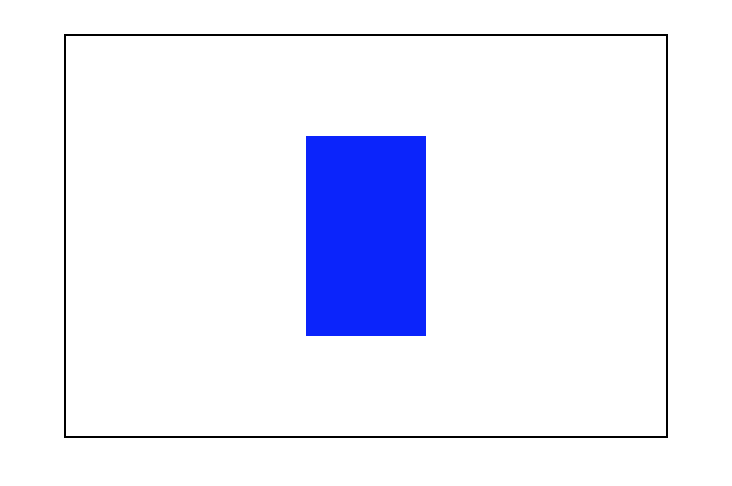

<!-- MarkdownTOC -->

- [行内元素居中（单行）](#%E8%A1%8C%E5%86%85%E5%85%83%E7%B4%A0%E5%B1%85%E4%B8%AD%EF%BC%88%E5%8D%95%E8%A1%8C%EF%BC%89)
- [利用position定位](#%E5%88%A9%E7%94%A8position%E5%AE%9A%E4%BD%8D)
	- [知道子元素和父元素大小](#%E7%9F%A5%E9%81%93%E5%AD%90%E5%85%83%E7%B4%A0%E5%92%8C%E7%88%B6%E5%85%83%E7%B4%A0%E5%A4%A7%E5%B0%8F)
	- [仅知道子元素大小](#%E4%BB%85%E7%9F%A5%E9%81%93%E5%AD%90%E5%85%83%E7%B4%A0%E5%A4%A7%E5%B0%8F)
	- [仅知道父元素大小](#%E4%BB%85%E7%9F%A5%E9%81%93%E7%88%B6%E5%85%83%E7%B4%A0%E5%A4%A7%E5%B0%8F)
	- [父元素和子元素大小都不知道](#%E7%88%B6%E5%85%83%E7%B4%A0%E5%92%8C%E5%AD%90%E5%85%83%E7%B4%A0%E5%A4%A7%E5%B0%8F%E9%83%BD%E4%B8%8D%E7%9F%A5%E9%81%93)
- [利用table居中](#%E5%88%A9%E7%94%A8table%E5%B1%85%E4%B8%AD)
- [利用display居中](#%E5%88%A9%E7%94%A8display%E5%B1%85%E4%B8%AD)
	- [display:table-cell](#displaytable-cell)
	- [display:flex](#displayflex)

<!-- /MarkdownTOC -->

写在前面：很多时候我们需要水平居中时候用margin: 0 auto;但我们要知道，这个方法有很大的局限性，它不能对浮动元素和绝对定位元素居中，而且对于其他元素必须在有width属性时才有作用。

这里说的居中是水平竖直同时居中，就像下面图中这样，而且我们居中的时元素而不是内容。(以下所有方法的结果和下图一样，不再附图)



> **以下方法如果没有特殊说明，都是基于下面这个部分：**

```
<!-- css 部分 -->
#parent{
  height: 200px;
  width: 300px;
  border: 1px solid #000;
}
#demo{
  height: 100px;
  width: 60px;
  background: blue;
}
<!-- html 部分 -->
<div id="parent">
  <div id="demo"></div>
</div>
```

### 行内元素居中（单行）
```
<!-- css 部分 -->
#parent{
  text-align: center;
}
#demo{
  display: inline-block;
  line-height: 200px;   /*   等于父元素高度   */
}
<!-- html 部分 -->
<div id="parent">
  <div id="demo">Hello</div><!-- 行内元素内部应有内容 -->
</div>
```
这里应注意，text-align在IE8及以上和其他主流浏览器只能对行内元素居中，但在IE6和IE7中可以对任何元素居中。

### 利用position定位

#### 知道子元素和父元素大小
- 方法一
```
 #parent{
    position: relative;
}
#demo{
  position: absolute;
  top: 50px;  /*    计算方法: （父元素高度-子元素高度)/2    */
  left:120px;   /*    计算方法: （父元素宽度-子元素宽度)/2    */
}
```
- 方法二
```
#parent{
  position: relative;
}
#demo{
  position: absolute;
  top: 0;
  left: 0;
  right: 0;
  bottom: 0;
  margin: auto;
}
```

#### 仅知道子元素大小
```
#parent{
  position: relative;
}
#demo{
  position: absolute;
  top: 50%;
  left: 50%;
  margin-top: -50px;  /*   子元素高度的一半   */
  margin-left: -30px;  /*   子元素宽度的一半   */
}
```

#### 仅知道父元素大小
```
#parent{
  position: relative;
}
#demo{
  position: absolute;
  top: 100px;  /*   父元素高度的一半   */
  left: 150px;   /*   父元素高度的一半   */
  transform: translateX(-50%) translateY(-50%);
}
```

#### 父元素和子元素大小都不知道
```
#parent{
  position: relative;
}
#demo{
  position: absolute;
  top: 50%;
  left: 50%;
  transform: translateX(-50%) translateY(-50%);
}
```

### 利用table居中

```
<!-- css 部分 -->
<!-- css部分继承开头声明部分 -->
#parent{
  text-align: center;
}
#demo{
  display: inline-block;
}
<!-- html 部分 -->
<!-- html部分不同于开头声明部分 -->
<table>
  <tr>
    <td id="parent">
      <div id="demo"></div>
    </td>
  </tr>
</table>
```

### 利用display居中

#### display:table-cell
```
#parent{
  display:table-cell;
  text-align: center;
  vertical-align: middle;
}
#demo{
  display: inline-block;
}
```

#### display:flex

```
#parent{
  justify-content:center;
  -webkit-align-items: center;
  -ms-flex-align: center;
  align-items: center;
  display: -webkit-flex;
  display: flex;
}
```

还有一种用font-size属性的居中对齐方式，由于只能在IE6，IE7中实现。这里就把它忽略了。

