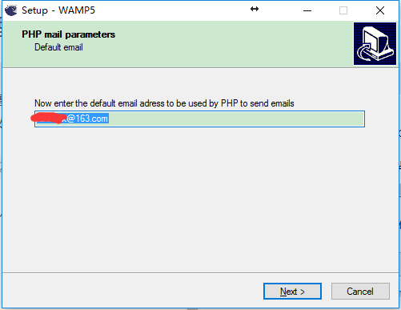

<!-- MarkdownTOC -->

- [windows 平台wamp配置](#windows-%E5%B9%B3%E5%8F%B0wamp%E9%85%8D%E7%BD%AE)
  - [wamp安装](#wamp%E5%AE%89%E8%A3%85)
  - [配置MySQL](#%E9%85%8D%E7%BD%AEmysql)
- [win2008服务器php环境——iis+fastCGI+MySQL](#win2008%E6%9C%8D%E5%8A%A1%E5%99%A8php%E7%8E%AF%E5%A2%83%E2%80%94%E2%80%94iisfastcgimysql)
  - [安装CGI](#%E5%AE%89%E8%A3%85cgi)
  - [安装MySQL](#%E5%AE%89%E8%A3%85mysql)
  - [相关c++库安装](#%E7%9B%B8%E5%85%B3c%E5%BA%93%E5%AE%89%E8%A3%85)
  - [php安装及配置](#php%E5%AE%89%E8%A3%85%E5%8F%8A%E9%85%8D%E7%BD%AE)
  - [IIS配置](#iis%E9%85%8D%E7%BD%AE)
  - [测试](#%E6%B5%8B%E8%AF%95)
- [Linux php环境配置——LAMP](#linux-php%E7%8E%AF%E5%A2%83%E9%85%8D%E7%BD%AE%E2%80%94%E2%80%94lamp)
  - [安装配置MySQL](#%E5%AE%89%E8%A3%85%E9%85%8D%E7%BD%AEmysql)
  - [安装Apache](#%E5%AE%89%E8%A3%85apache)
  - [安装php](#%E5%AE%89%E8%A3%85php)
  - [必要的php扩展包](#%E5%BF%85%E8%A6%81%E7%9A%84php%E6%89%A9%E5%B1%95%E5%8C%85)
  - [安装配置phpmyadmin](#%E5%AE%89%E8%A3%85%E9%85%8D%E7%BD%AEphpmyadmin)
- [Mac php环境配置](#mac-php%E7%8E%AF%E5%A2%83%E9%85%8D%E7%BD%AE)

<!-- /MarkdownTOC -->

## windows 平台wamp配置

### wamp安装
[下载wamp](http://www.wampserver.com/)，进行安装，由于最新版需要VS2015的支持，博主这里安装了旧版wamp，下面是安装过程：
一路点击`next>`(协议需要同意，这个都懂），安装过程中注意一下2个界面：

选择安装路径，注意路径中不要有汉语就好


选择是否开机自启动，根据需要选择，这里我允许了自启动。


安装过程中会要求我们选择网站的根目录（如下图），也就是127.0.0.1(localhost)中web的根目录


等待安装完毕，自动开始配置
第一个是STMP邮件传输协议配置，保持默认就行


php邮件的默认发件人，可以修改，不过要记住，否则以后想用就懵圈了



选择默认浏览器，去找你的浏览器的exe文件就行了。


安装完后，启动php。你会在window托盘中看到这个


点开以后红框内由上到下依次是：
> 打开phpWeb根目录
> 日志文件
> 配置文件
> Apache组件
> php设置
> Alias目录

下方控制各个服务的开关，Apache默认工作在80端口。打开phpWeb根目录，如果你发现这个目录是空的，就去安装目录把www文件拷贝进来
这个时候在浏览器输入http://localhost/www/ 出现了下图说明你的环境已经配置好了


这就结束了吗？

### 配置MySQL

很多人说通过phpmyadmin直接修改mysql表里的密码就行，原理上应该是没错，但是修改后mysql整个库都不见了，结果只能重装WAMP，最终还是要用下面的命令行去修改。

1、如果mysql默认打开

点击MySQL console(mySql 控制台），要求输入密码（初始没有密码，直接回车），进入mysql


进入mysql数据库，可以看到里面有一个user表


执行一条SQL语句修改密码：
```sql
update user set password=PASSWORD('yourPassword') where user='root';
```
再执行flush使修改生效：
```shell
flush privileges;
```
然后quit退出，过程如下图：


2、如果你的电脑和博主一样，之前用过mysql，这里可能会遇到麻烦——mysql无法启动。

你需要做的就是把之前装的mysql卸载干净，包括mysql程序，服务和注册表。最简单的方法就是找到之前的mysql安装包，运行安装包，选择remove。如果你没有安装包了，那就去程序与功能运行uninstall.exe吧。


好了，我要去重启电脑了……
重启以后就好了（如果还不能用就点那个install service）！


之后密码设置就和上面一样了。

## win2008服务器php环境——iis+fastCGI+MySQL

### 安装CGI
如下图，打开控制面板-->程序与功能-->打开或关闭windows功能-->角色-->添加角色


选择Web服务器(IIS)


一路下一步，看到下面这个页面。一定要选CGI这一项，其它和普通web配置类似，按需选择。


然后下一步-->安装，等待安装结束后关闭该对话框。
浏览器打开http://localhost/ 应该出现如下界面，表示成功。


### 安装MySQL

[下载MySQL](http://www.mysql.com/)，运行安装。
下面截图仅仅是有选项或输入的页面，其它页面直接`下一步`

同意协议，典型安装


一路next，安装完成后一路next，简单下面页面，勾选并finish


选择标准配置


都勾上，否则安装完自己慢慢配置环境变量吧


设置root用户的密码，如果需要远程使用，就把箭头所指那个勾勾上


继续执行，直到成功配置（如下，然后finish）


然后点击`win+R`输出cmd打开命令行，输入：
```shell
mysql -u root -p
```
然后输入刚设置的root用户密码，出现下方内容则配置成功


###相关c++库安装

下载安装[Microsoft Visual C++ 2010 Redistributable Package](https://www.microsoft.com/zh-CN/download/details.aspx?id=30679)

下载安装[Microsoft .NET Framework 4](http://download.microsoft.com/download/7/5/0/7502f4e9-1f90-4895-9259-1bde67b8b9a1/vcredist_x86.exe)

这个安装过程没有可说的。

### php安装及配置
下载non-thread-safe版php [\[32位\]](http://windows.php.net/downloads/releases/archives/php-5.6.0-nts-Win32-VC11-x86.zip)<!--(http://windows.php.net/download#php-7.0)--> [\[64位\]](http://windows.php.net/downloads/releases/archives/php-5.6.0-nts-Win32-VC11-x86.zip)

解压这个文件到文件夹php(起个名便于下文描述），把这个文件夹放在一个没有汉语和空格的路径下。

[下载php加速软件](http://downloads.zend.com/guard/5.5.0/ZendGuardLoader-php-5.3-Windows.zip)

解压加速软件，把加速软件中的ZendLoader.dll拷贝到刚才php文件夹中的ext文件夹中

打开php文件夹，复制`php.ini-production`文件重命名为`php.ini`放在同一个目录下。


打开php.ini，修改以下参数（别忘了去掉前面的分号）：
```sh
extension_dir = "<你的PHP安装程序安装路径>"
date.timezone = Aisa/Shanghai
session.save_path = "<建一个文件夹放php会话临时数据>"
upload_tmp_dir = "<建一个文件夹放上传会话临时数据>"
```


其次清除下列内容前面的分号语句前面的分号（注意那个注释）。
```sh
extension=php_curl.dll
extension=php_gd2.dll
extension=php_mbstring.dll
extension=php_mysql.dll
extension=php_pdo_mysql.dll
extension=php_pdo_odbc.dll
extension=php_xmlrpc.dll
```


### IIS配置

打开iis，选择处理程序映射


点击右边的“添加模块映射”，完成下表（注意文件路径和你存放的一致）


然后确定并关闭iis

###测试
建立如下文件：C:\inetpub\wwwroot\index.php

index.php文件内容如下：
```php
<?php
Phpinfo();
?>
```

在浏览器打开http://localhost/index.php，出现如下界面就配置成功了


## Linux php环境配置——LAMP

下面在Ubuntu14.04中配置，注意安装顺序一致。
由于安装东西比较多，我直接在root权限下操作，如果你在用户权限下，请再命令前添加sudo

### 安装配置MySQL
```shell
apt-get install mysql-server
```
输入上面命令，点击Y 开始安装


中途会要求设置mysql的root用户密码，如下。之后还要确认一次


```shell
netstat -tap | grep mysql
```
输入上述命令，查看是否安装成功，下图为成功时的输出


### 安装Apache

```shell
apt-get install apache2
```
输入上面命令安装apache


安装完后打开浏览器http://127.0.0.1，显示如下信息为安装成功


### 安装php

```shell
apt-get install php5 libapache2-mod-php5
```
输入上面命令安装php5
之后配置www目录属性，在`/var`中我们可以看到www目录，如图，下图列表中最后一个：


```shell
chmod 777 /var/www
```
运行上面代码修改www目录权限，777给了它所有权限。如下图


之后进入/var/www/html 目录，创建一个index.php文件，文件内容如下
```php
<?php
phpinfo();
?>
```


然后打开浏览器，进入http://127.0.0.1/index.php，下图为安装成功


### 必要的php扩展包

```shell
apt-get install php5-mysql php5-curl php5-gd php5-intl php-pear php5-imagick php5-imap php5-mcrypt php5-memcache php5-ming php5-ps php5-pspell php5-recode php5-snmp php5-sqlite php5-tidy php5-xmlrpc php5-xsl;
```
运行上面这一堆就好了，如果你熟悉它们，可以根据自己的需要选装。

### 安装配置phpmyadmin

```shell
apt-get install phpmyadmin
```
运行上面命令安装phpmyadmin，中间需要配置，如下：


下图输入数据库管理员密码，就是刚才设置的mysql的root密码


随即设置phpmyadmin的密码（之后还要确认一次）：


安装结束。开始配置phpmyadmin。执行下面命名编辑apache配置文件：
```shell
vim /etc/apache2/apache2.conf
```
在配置文件最后添加下面内容(如图)
```shell
Include /etc/phpmyadmin/apache.conf
```


保存退出，用下列命令重启apache，使配置生效。
```shell
service apache2 restart
```

用浏览器打开http://127.0.0.1/phpmyadmin/，显示下图安装成功：


附：修改网站路径方法

1. "sudo vim /etc/apache2/apache2.conf"-->找到现在的位置-->更改"/var/www/html/"为新的根目录“/home/www”即可

2. "sudo vi/etc/apache2/sites-available/000-default.conf"-->找到"DocumentRoot /var/www/html"的位置-->更改"/var/www/html"为新的根目录“/home/www”即可。

3. 重启Apache服务器： sudo /etc/init.d/apache2 restart

## Mac php环境配置

mac可是说对web开发的是及其有好的，它自带了apache和php，我们只需要对它进行配置就OK了。
```shell
sudo apachectl start
```
在终端输入上方命令打开apache，打开浏览器，输入http://localhost/，看到下图就对了


继续开启php，输入如下命令，编辑配置文件
```shell
sudo vim /etc/apache2/httpd.conf
```
找到下面这句，把前面的#去掉，这样php就打开了，等等，先不急退出vim
> \#LoadModule php5_module libexec/apache2/libphp5.so

默认的web主目录是 /Library/WebServer/Documents ，可以在这个文件里面修改这个路径：
> DocumentRoot "/Library/WebServer/Documents"
> <Directory "/Library/WebServer/Documents">

把上面两行引号中的路径改为自己的web主目录路径，就可以保存退出了。重启一下apache：
```shell
sudo apachectl restart
```

我的路径在/users/faremax/website。
进入这个文件夹，创建index.php文件，内容如下：
```php
<?php phpinfo(); ?>
```
之后就可以打开浏览浏览器查看localhost页了，配置成功如下：


