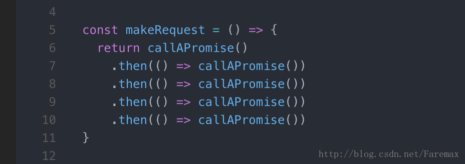
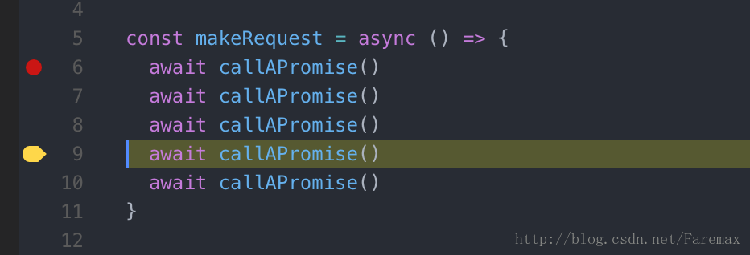

六个 Async/Await 取代 Promises 的原因

原文链接：[https://hackernoon.com/6-reasons-why-javascripts-async-await-blows-promises-away-tutorial-c7ec10518dd9](https://hackernoon.com/6-reasons-why-javascripts-async-await-blows-promises-away-tutorial-c7ec10518dd9)

如果你错过了，那么 Node 7.6 开始支持 async/await 了。如果你还没有尝试过它，这里有一大堆理由和例子告诉你为什么要不顾一切的直接使用它。

[更新]：[Node 8 LTS](https://nodejs.org/en/blog/release/v8.0.0/) 已经发布，完整支持 Async/Await
[编辑]：严格来说的嵌入式代码并不在中等规模的原生应用程序执行，而是工作在移动浏览器上。如果你正在应用程序上读这篇文章，点击共享图标并选择“在浏览器中打开”以查看代码片段。（译注，需进入原文链接）

## Async/await 101
Async/await 101

对于那些还没有听说过这篇文章主题的人，这篇文章可以带你快速入门。

- Async/await 是一种编写异步代码的新方法。曾经编写异步代码都使用回调函数和 promise。
- Async/await 是建立在 promise 之上的，它不能被用作回调函数。
- Async/await 像 promise 一样是非阻塞的。
- Async/await 使得异步代码看上去更像是同步代码，这就是它最强大的地方

## 语法
假设一个 getJSON 函数返回一个 promise 对象，并且这个 promise 对象接受了 JSON 对象。我们仅仅想调用它输出 JSON 并返回 'done'。
以下是利用 promise 实现它。
```js
const makeRequest = () =>
  getJSON()
    .then(data => {
      console.log(data)
      return "done"
    })

makeRequest()
```
以下是使用 async/await 实现。
```js
const makeRequest = async () => {
  console.log(await getJSON())
  return "done"
}

makeRequest()
```

这里有一些区别

1. 在我们的函数之前有 async 关键字，await 关键字只能在定义了 async 的函数中使用。所有的 async function 都会默认的返回一个 promise 对象，promise 中的 resolve 值就是异步函数返回的值。（例子中是 'done'）
2. 以上几点表明我们不能在代码顶层使用 await，因为它并不在一个 async function 内。
```js
// 该行在顶层，无法执行
// await makeRequest()

// 该行可以执行
makeRequest().then((result) => {
  // do something
})
```
3. `await getJSON()` 表示 `console.log` 等到 `getJSON()` 的 promise 执行结束后执行，并打印它的值。


## 为什么它更好

### 1. 简洁明了
看看有多少代码不需要写了！即使在上面精心设计的例子中，我们也清楚地保存了大量的代码。我们不需要编写 `.then`，创建一个匿名函数来处理响应，或者给不需要使用的变量一个名字'data'。我们还避免了代码嵌套。在下面这个例子中，这些小优点很快的一点点累加，变得更明显。

```js
// 译注：作者似乎遗漏了这里的例子，翻译时这里使用了上文中已有的例子
const makeRequest = async () => {
  console.log(await getJSON())
  return "done"
}

makeRequest()
```

### 2. 错误处理
Async/await 使得可以建立一个传统的 try/catch 就能够同时处理同步和异步错误。在下面的示例中使用 promise，当 JSON.parse 失败时，try/catch 无法处理其中的错误，因为错误发生在 promise 内部。我们需要在 promise 上调用 `.catch` 并复制我们的错误处理代码。时不会因为它在保证发生JSON.parse失败处理。我们需要打电话，赶在承诺和重复我们的错误处理代码，在你编写完成的代码中，这（理想的）比 console.log 更复杂。
```js
const makeRequest = () => {
  try {
    getJSON()
      .then(result => {
        // this parse may fail
        const data = JSON.parse(result)
        console.log(data)
      })
      // uncomment this block to handle asynchronous errors
      // .catch((err) => {
      //   console.log(err)
      // })
  } catch (err) {
    console.log(err)
  }
}
```
现在，来看看 async/await 写的相同的代码。现在，catch 块将会处理解析错误。
```js
const makeRequest = async () => {
  try {
    // this parse may fail
    const data = JSON.parse(await getJSON())
    console.log(data)
  } catch (err) {
    console.log(err)
  }
}
```

### 3. 条件句
试想下面这段代码获取一些数据然后决定应该返回它还是基于其中一些值在获取更多的数据。
```js
const makeRequest = () => {
  return getJSON()
    .then(data => {
      if (data.needsAnotherRequest) {
        return makeAnotherRequest(data)
          .then(moreData => {
            console.log(moreData)
            return moreData
          })
      } else {
        console.log(data)
        return data
      }
    })
}
```
这段代码看上去就很头疼。在那些嵌套（6层）中，很容易丢失括号和那些用来向 promise 传播最终结果的 return 语句。
当我们用 async/await 重写这个例子后就变得更易读了。
```js
const makeRequest = async () => {
  const data = await getJSON()
  if (data.needsAnotherRequest) {
    const moreData = await makeAnotherRequest(data);
    console.log(moreData)
    return moreData
  } else {
    console.log(data)
    return data
  }
}
```

### 4. 中间量
你可能发现，当你调用 promise1 而后使用它的返回值调用 promise2，之后在使用前两个 promise 的结果调用 promise3 时，你的代码很可能像这样：
```js
const makeRequest = () => {
  return promise1()
    .then(value1 => {
      // do something
      return promise2(value1)
        .then(value2 => {
          // do something
          return promise3(value1, value2)
        })
    })
}
```
如果 promise3 不需要 value1，可以很简单的将 promise 展开成一个很小的嵌套，如果你不喜欢这样写，你可以把 value1 和 value2 放到一个 Promise.all 中以避免深度的嵌套，像这样：
```js
const makeRequest = () => {
  return promise1()
    .then(value1 => {
      // do something
      return Promise.all([value1, promise2(value1)])
    })
    .then(([value1, value2]) => {
      // do something
      return promise3(value1, value2)
    })
}
```
这个方法为了可读性牺牲了语义。这里没有理由将 value1 和 value2 放在同一个数组里，仅仅是为了避免 promise 嵌套。
同样的逻辑配合 async/await 变得非常简单和直观。在你努力让 promise 看上去不那么无聊的时间里，你惊讶的发现所有的事情都已经完成。
```js
const makeRequest = async () => {
  const value1 = await promise1()
  const value2 = await promise2(value1)
  return promise3(value1, value2)
}
```

### 5. 错误攻击
想象一块代码链式地调用了许多 promise，但其中某个地方抛出了一个错误。
```js
const makeRequest = () => {
  return callAPromise()
    .then(() => callAPromise())
    .then(() => callAPromise())
    .then(() => callAPromise())
    .then(() => callAPromise())
    .then(() => {
      throw new Error("oops");
    })
}

makeRequest()
  .catch(err => {
    console.log(err);
    // output
    // Error: oops at callAPromise.then.then.then.then.then (index.js:8:13)
  })
```
错误栈从 promise 链中返回，但被没有关于哪里发生了错误的线索。更糟糕的是，这具有误导性，它所包含的唯一函数名是 `callAPromise` ，这个函数名和错误毫无关系（文件和行号的仍然是有用的）。
然而，async/await 的错误栈会指向包含错误的函数。
```js
const makeRequest = async () => {
  await callAPromise()
  await callAPromise()
  await callAPromise()
  await callAPromise()
  await callAPromise()
  throw new Error("oops");
}

makeRequest()
  .catch(err => {
    console.log(err);
    // output
    // Error: oops at makeRequest (index.js:7:9)
  })
```
当您在本地环境中开发并在编辑器中打开文件时，这并不是一个巨大的好处，但是当您试图理解来自您的生产服务器的错误日志时，它是非常有用的。在这种情况下，了解错误发生在 makeRequest 比知道错误来自一个 then 之后的 then 之后的 then …… 更好。

### 6. 调试
最后一点，依然很重要，async/await 是调试的的杀手锏，使用起来十分轻松。调试 promise 十分痛苦有 2 个原因：

1. 你无法在返回表达式的箭头函数中设置断点（没有函数体）

2. 如果你在一个 `.then` 块中设置断点，并且使用如单步调试这样的调试快捷方式，调试器不会移动到下一个 `.then`，因为它仅仅可以一步步的走过同步代码。
通过 async/await 你就不需要那些箭头函数了，你可以单步通过 await 调用，确切来将就像同步调用一样。


## 结论
Async/await 是过去几年已经被加入 JavaScript 中十分具有革命性的特性之一。它使得你可实现 大量异步的 promise ，并提供一种直接的代替方案。

## 关注
在你使用这个特性的时候可能会报有一些怀疑。它是的异步代码变得不明确：我们知道当我们用眼睛看到一个回调函数或者 `.then` 的时候就会判断这是段异步代码。我们需要几周的时间来让我们的的眼睛适应这些新的符号，但 C# 已经有这个特点多年，熟悉的人就知道这很小的、暂时的不便是值得的。
Node 7 并不是长期支持的发布版：是的，Node 8 下个月即将来了，并且把你的代码移植的新版本将不费吹灰之力。[更新]: Node 8 LTS 已经来了.

关注原作者 twitter @imgaafar
