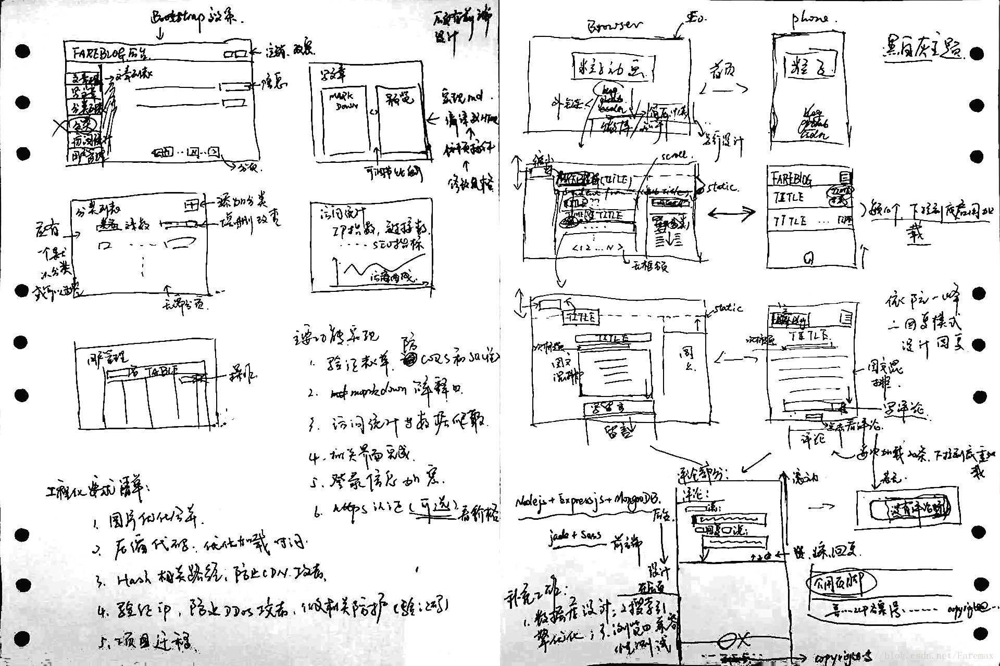
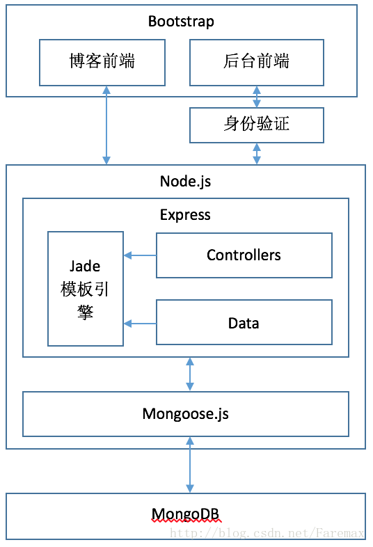
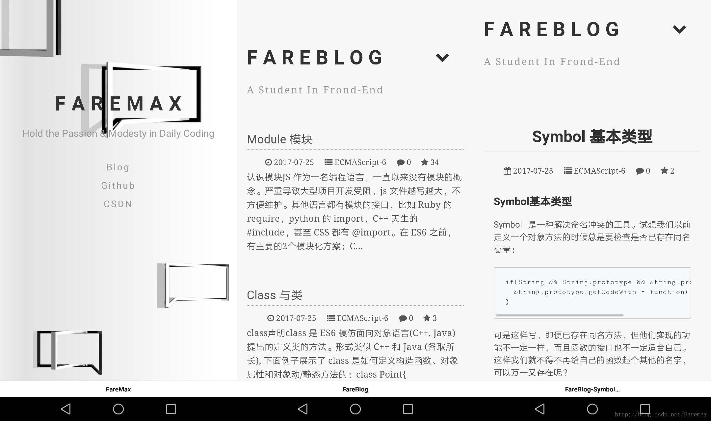
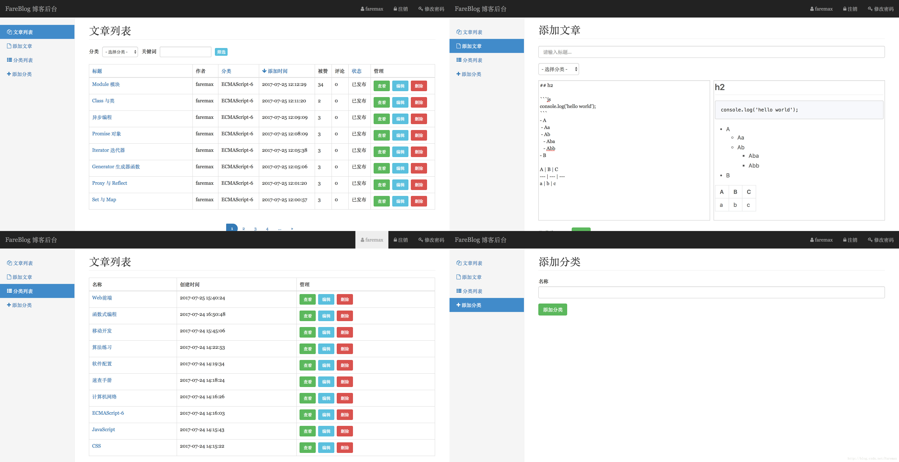

> 经常在各种论坛、博客还有 github 上活跃的朋友不难发现，许多大牛都有自己的网站，也多以博客为主。博主作为一个立志前端的大白，难道不应该和大牛学习么？

> 说干就干，前端部分和 web 开发博主做了很多学习和总结，不少也写成了博客。对于后端，博主不敢说完全没有经验，但接触的也都比较简单。于是乎，博主六月底开始看 Node 和 Express，利用空闲时间做了自己的博客，现阶段还有许多不足，需要后续不断改进。不过这不妨碍博主先总结一下自己的感受。

总结之前，先附上博客链接： [BareBlog](http://www.faremax.com.cn)

## UI设计 和 架构设计

博主深刻的感受到自己并没有什么艺术细胞，只能去看各种设计稿刺激一下自己的神经，比如 Dribbble、water Chen UI、 千库、 DotSpin、LogoSpire、Tencent ISUX 等等。其实不止这些，比较我看见的链接就会点进去，不知道点了多少，然后就这么憋出了一份入门级都算不上的 UI 设计图(不要笑，要指点)。


对，就是这么简单粗暴，连 ps 都没用！

架构设计部分也没有太深入的知识，简单的 MVC 结构，对于架构入门来说再适合不过了，即使现在的前端，有了 MV 结构的 React，MVVM 的 Angular 和 vue。架构如下图，这次终于用到 ps，其实找个 word 就可以画的。


(还是这句话：不要笑，要指点)

## 框架选型

由于自己还没有看到Angular、vue、React这写流行的框架，前端样式的实现还是选择使用了 Bootstrap 和 Sass。而结构选择了 jade 模板引擎。这里会有以下几个问题：

> 为什么使用 Bootstrap ？
>
> 这个不复杂，毕竟我希望实现兼容移动端和 PC 端的响应式页面，所以我只能说，媒体查询是利器，Bootstrap 是别无可选。

> 为什么我使用 Sass ？
>
> 写习惯了 css 就不太习惯 Scss 的缩进，毕竟还有 less 和 Sass, 而选择了 Sass 的原因如下：
> 1. Sass有一些成熟稳定的框架，如是Compass，Foundation，侧面说明 Sass 比 Less 更好吧。
> 2. 还有一个原因是国外讨论Sass的同行要多于Less，使用 Sass 的也更多一些。
> 3. Sass有更清晰的语法，像一门编程语言一样，不像 Less 的混合大法使用起来感觉不舒服。
>
> 如果说 Sass 有么不好，那就是它还是建立在 ruby 上，有点不直接，比较麻烦。

> 为何使用 jade ?
>
> 这个不需要太多理由，比 html 简洁，还比 html 强大！比起其他模板引擎，他又是专门为 html 服务的。和 EJS 相比，jade 支持模板继承，而 EJS 不支持。
> 其实我是个人开发，如果是团队开发，我还是觉得 EJS 会更好，可能是博主适应了挖坑的写法，用 html 会对前后端开发都方便许多。而且 jade 的缩进风格跨 IDE 会不方便。当然还有其他的模板引擎，比如 swig，对博主来说完全是不习惯 Django 的风格。
>
> 当然这里还有个其它原因：Express 默认 jade !!!

后端开发使用了 Nodejs + Express + MongoDB, 不得不说这个组合的资料真的很多，学习起来方便一些。这里没有为什么，就是想学 Node，而不是世界上最美的语言，毕竟有 js 基础嘛。

> 为何使用 MongoDB ?
>
>说实在的，这是博主第一次接触并使用非关系数据库，突然发现很喜欢它。之前使用的更多的是 MySQL。毕竟博客系统，存储的数据是文章，所以关系数据库定义数据类型实在是个坑，分配大了浪费，分配小了怎么写东西！当然，还有其他的问题。由于我发现许多文章都使用 MongoDB，其实也就没有再犹豫。这里想要说的还是使用它的感受，一句话概括：JSON 的存储方式真的是既直接，又爽快！

> 为何使用 Express ?
>
> 我们都知道，Express 其实不能说是对 Node 的二次开发，而是一个扩展。博主开始学习前端，从基础做起来是不会有错的，如果你希望快速的开发，仅仅当它是个工具，那用 sail 会省事很多，再配合脚手架，事半功倍。当然 sail 除了官方文档好像也没啥别的可以学习了，这个......
> 其实 sail 发展不起来也是有原因的：
>
>  当然，如果有时间，博主倒还想学习一下，koa 和 hapi

最后一个选择就是项目构建工具了，这里可以直接解释我为何使用了 Gulp

> 为什么选择 Gulp ?
>
> 其实这里可选的常用构建工具还有 webpack 和 grunt。gulp 和 webpack 其实各有优势，比如 gulp 任务定义和管理，Webpack 做不到，Webpack 基于模块的依赖构建。gulp 也做不好。而 grunt 的确是比较笨重复杂，明显能看出来现在用的已经比较少了。
> 其实 gulp 和 webpack 使用的感觉也不一样，gulp 是在写一个个的任务，而 webpack 是在写一个配置文件，注意我说的是感觉。
> 从他们的核心功能来讲，Gulp 定义任务和阻止，基于文件流的构建。而 webpack 按照模块的依赖构建目标文件，具有支持不同模块的 loader 体系。如果要用 Webpack，请确保项目模块化，模块之间充分依赖。除此之外的构建工作，都应该交给 gulp 继续完成。博主目前的这个项目还不算很大，模块依赖简单，但期望完成诸如版本号替换，压缩代码，合并文件，发布到服务器等和模块化关系不大的工作，所以使用了 gulp。
>
> 博主使用 Gulp 也是自己的学习过程，正是因为 Gulp 和 Webpack 各有优缺点，下一步博主还是计划能用 Webpack 重新构建一下这个项目，亲自感受一下它们的魅力。

## 项目的整体流程

0. 确定功能，根据需求选择合适的框架和工具
1. 设计界面、架构、数据库的模式
2. 构建 express 的服务器框架和目录结构
3. 设计 gulp task 和 livereload
4. 编写页面
5. 测试功能模块
6. 做必要的性能优化

## 遇到的难点和坑

总结这个问题，博主真的感觉好为难。以博主的性格，做之前会觉得：“这个东西没做过，好难，但查查资料今天上午一定能做出来”，做完了以后总觉得：“没想到挺简单的！！！”所以说呢，现在做完了，感觉都不难了。

其实最难的应该属于快速学习并使用这些工具，快速查找并解决问题。博主用了一个月的每个晚上和周末学习了 Nodejs + Express + MongoDB + Gulp, 做了这个博客，可以说大致理解他们的开发逻辑，结构，和基本使用方法。很多难以解决的问题，也无非是 google、知乎、github。

1. 登录功能实现
登录功能，利用了 passport 和 validator 组件实现，首先是验证登录，在 user model 中实现方法 `verifyPassword`：
```js
UserSchema.methods.verifyPassword = function(password){
  return password === this.password;
}
```
而对于需要验证的页面，在 user 的 controller 中实现了 中间件：
```js
var needLogin = function(req, res, next){
  if(req.user){
    next();
  } else {
    req.flash('error', '请先登录');
    res.redirect('/admin/users/login');
  }
}
module.exports.requireLogin = needLogin;
```

对于与 validator 在 express.js 中按要求添加 use 就可以啦。
```js
app.use(validator({
    errorFormatter: function(param, msg, value) {
        var namespace = param.split('.')
        , root    = namespace.shift()
        , formParam = root;

      while(namespace.length) {
        formParam += '[' + namespace.shift() + ']';
      }
      return {
        param : formParam,
        msg   : msg,
        value : value
      };
    }
  }));
```

加密使用了 md5， 这个不多说了。还有一点就是登录状态验证：在服务器端，登录状态被存储在数据库的 sessions 集合中，通过 passport 和 express-session 实现：
```js
app.use(session({
    secret: 'nodeblog',
    resave: false,
    saveUnitialized: true,
    cookie: {secure: false},
    store: new MongoStore({ mongooseConnection: connection })
  }));
  app.use(passport.initialize());
  app.use(passport.session());
  app.use(function(req, res, next){
    req.user = null;
    if(req.session.passport && req.session.passport.user){
      User.findById(req.session.passport.user, function(err, user){
        if(err) return next(err);
        user.password = null;
        req.user = user;
        next();
      })
    } else {
      next();
    }
  })
```
2. markdown 和内容验证
这个功能之前去找了 github 中 'markdown' 排第一的 node 插件 marked 插件实现。关于插件这里不多说了。这里重点说一下的内容验证，因为内容验证是安全性保障的重要一个环节。这里即要保障恶意脚步不会被提交，或运行，而且还要保障 markdown 可以很好的转换数据。对于输入的字符串处理，博主自己实现了几个工具函数：
```js
var clearUtil = function(app){};

// 清除 XML 标签
clearUtil.clearXMLTags = function(str, deeply){
  var deeply = deeply || false;
  var temp = str.replace(/<[^>]+>/g, '');
  if(deeply){
    temp = temp.replace(/[\r\n][\r\n]+/g, '');
  }
  return temp;
};

// 清除 script 标签及内容
clearUtil.clearScripts = function(str){
  return str.replace(/<script>.*?<\/script>/ig,'');
};

// 清除换号符 CR/LF
clearUtil.clearReturns = function(str){
  return str.replace(/[\r\n]/g, '');
};

// 转义 xml 尖括号
clearUtil.TransferTags = function(str){
  var temp = str.concat();
  temp = temp.replace(/</g, '&lt;');
  temp = temp.replace(/>/g, '&gt;');
  return temp;
};

module.exports = clearUtil;
```

3. 性能优化
这个部分，主要工作是代码压缩，和缓存利用。
压缩方法都是十分主流的方法，利用
imagemin, clean-css, uglify, 压缩了图片，css 和 js， 同时网页以 gzip 格式传输，减小体积。
同时，对 css 和 js 附加缓存，配合 E-Tag 和 版本号实现服务器更新，这一部分其实 Express 已经帮我们实现好了。所以这个部分，主要十几个 gulp 配置
```js
gulp.task('sass', function () {
  gulp.src('./source/css/**/*.scss')
      .pipe(autoprefix())
      .pipe(sass())
      .pipe(clearCss())
      .pipe(gulp.dest('./dist/css'))
      .pipe(browserSync.reload({stream:true}));
});
gulp.task('imagemin', function(){
  gulp.src('./source/img/*.{png,jpg,gif,ico}')
      .pipe(imagemin())
      .pipe(gulp.dest('./dist/img'));
});
gulp.task('minifyjs', function() {
  return gulp.src('./source/js/**/*.js')
      .pipe(rename({suffix: '.min'}))
      .pipe(uglify())
      .pipe(gulp.dest('./dist/js'));
});
```

4. 偷懒配置

博主用了一个 CentOS 的服务器，其实通过 scp 和 ssh 就可以实现上传和配置了，但依据“进步源于懒惰”的码农提高准则，博主还是做了一个自己上传部署的功能:
```js
/* part of gulpfile.js */
var shell = require('gulp-shell');
var ssh = require('gulp-ssh');
var deployConfig = require("./deploy-config");
var gulpSequence = require('gulp-sequence');
var zip = require('gulp-zip');
var through = require('through2');
var async = require('async');
var scpClient = require('scp2');
var gulpUtil = require('gulp-util');
var deploySSH = require('./deploy-ssh');

//上传功能实现主任务
gulp.task('up', function (){
  shell.task(['rm -rf publish']);
  gulpSequence('copyFile', 'zipFile', 'deploy',  function() {
     gulpUtil.log(PLUGIN_NAME, "***** Deploy Finished！！！！");
     process.exit(0);
  });
});

gulp.task('copyFile', function() {
  return gulp.src(
          [
              'node_modules/**',
              '*.json',
              '*.js',
              'app/**',
              'config/**',
              'dist/**',
              '!config.js'
          ], { base: './'})
          .pipe(gulp.dest('./publish'));
});

gulp.task('zipFile', function() {
  return gulp.src(['publish/**'], { base: './' })
             .pipe(zip('publish.zip'))
             .pipe(gulp.dest('./publish'));
});

gulp.task('deploy', function() {
  var config = deployConfig.production;
  config.deployPath = '/home/faremax/website/publish/';
  return gulp.src("publish/publish.zip", { base: './' })
             .pipe(deploySSH({
              servers: config.servers,
              dest: config.deployPath + 'publish.zip',
              logPath: 'deploy',
              shell:[ 'cd ' + config.deployPath,
                      'shopt -s extglob',
                      'rm -rf !(logs|node_modules|config.js|publish.zip)',
                      'unzip -o publish.zip',
                      'cp -rf publish/** .',
                      'rm -rf publish',
                      "rm publish.zip",
                      'npm install --production',
                      'pm2 startOrRestart pm2-start.json'],
          }));
});
```

```js
/* deploy-ssh.js */
var gulp = require('gulp');
var gutil = require('gulp-util');
var through = require('through2');
var ScpClient = require('scp2').Client;
var ssh = require('gulp-ssh');
var async = require('async');
var ProgressBar = require('progress');

const PLUGIN_NAME = 'deploy-ssh'

module.exports = function (options) {
    var servers = options.servers;
    var dest = options.dest;
    var shell = options.shell;
    var logPath = options.logPath;

    return through.obj(function (file, enc, callback) {
        if (file.isNull()) {
            callback(null, file);
            return;
        }

        if (file.isStream()) {
            return callback(new gutil.PluginError(PLUGIN_NAME, 'No stream support'));
        }

        var i = 0;
        async.eachSeries(servers, function(server, done) {
            var hostName = server.sshConfig.host;
            gutil.log(PLUGIN_NAME, "start deploy:" + hostName)
            var client = new ScpClient(server.sshConfig);

            var bar = null;
            client.on("transfer",  function(buffer, uploaded, total){
                if(bar == null){
                    bar = new ProgressBar(hostName + ' uploading [:bar] :percent :elapsed s', {
                        complete: '=',
                        incomplete: ' ',
                        width: 50,
                        total: total
                    });
                }
                bar.tick(1);
            });

            client.write({
                destination: dest,
                content: file.contents
            }, function () {
                ssh(server).shell(shell, {filePath: logPath + "-" + hostName + ".log", autoExit: true}).on('error', function (err) {
                    done(err);

                    gutil.PluginError(PLUGIN_NAME,  err)
                }).on('finish', function () {
                    gutil.log(PLUGIN_NAME, "finish deploy:" + hostName);

                    done();

                    if (++i === servers.length) {
                        callback(null, file);
                    }
                }).pipe(gulp.dest('logs'));
            });
        });

    });

};
```

```js
/* deploy-config.js */
var config = {
    production:{
        servers:[
        {
            sshConfig: {
                host: '114,215,133,238',
                port: 80,
                username: '******',
                password: '******',
                readyTimeout: 600000
            }
        }]
    }
};

module.exports = config;
```

## 网站实现效果

从功能上来看，其实仅仅实现了博客展示、博客的管理和分类管理3个基本部分，前台是给用户看的，花的时间比较多，还有就是安全，这个不能大意。

- 前台效果，这个大家都能看到，不说了：


- 当然，前台还有移动端：


- 后台效果，东西不多，界面很简洁，很多东西还需要逐步添加：

