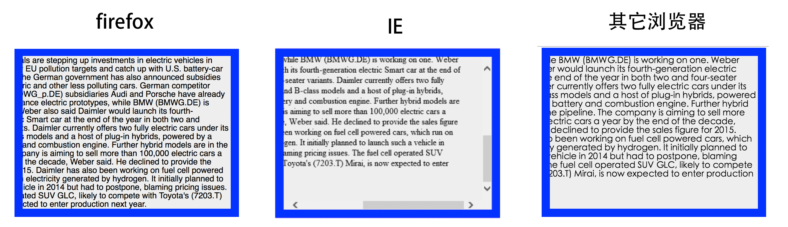

<!-- MarkdownTOC -->

- [元素属性中的各种“距离”](#%E5%85%83%E7%B4%A0%E5%B1%9E%E6%80%A7%E4%B8%AD%E7%9A%84%E5%90%84%E7%A7%8D%E2%80%9C%E8%B7%9D%E7%A6%BB%E2%80%9D)
- [鼠标事件中的各种“距离”](#%E9%BC%A0%E6%A0%87%E4%BA%8B%E4%BB%B6%E4%B8%AD%E7%9A%84%E5%90%84%E7%A7%8D%E2%80%9C%E8%B7%9D%E7%A6%BB%E2%80%9D)
- [jQuery中元素距离属性](#jquery%E4%B8%AD%E5%85%83%E7%B4%A0%E8%B7%9D%E7%A6%BB%E5%B1%9E%E6%80%A7)

<!-- /MarkdownTOC -->

js中有很多“距离”，为了不会混淆这里总结一下其中部分距离

本文包括`元素属性`相关的距离和`鼠标事件`中的距离，废话不多说，进入正文

先补充一下，本文的测试环境如下：
> Chrome Dev 54.0.2840.71
> Firefox 49.0
> Opera 41.0
> Safari 10.1
> IE 11。
>
> 前四者运行在macOS Sierra 10.12上，IE11运行在搭载windows10 1607的虚拟机上

### 元素属性中的各种“距离”

元素属性中的距离有以下6对：

> scrollLeft: 设置或获取位于对象左边界和窗口中可见内容的最左端之间的距离
> scrollTop: 设置或获取位于对象最顶端和窗口中可见内容的最顶端之间的距离

>  offsetHeight: 获得对象的可视区域的高度，包括边框
> offsetWidth: 获得对象的可视区域的宽度，包括边框

> clientHeight: 获得对象边框内部分的高度
> clientWidth: 获得对象边框内部分的宽度

> offsetLeft: 获取对象相对于版面或由offsetParent属性指定的父坐标的计算左侧位置
> offsetTop: 获取对象相对于版面或由offsetTop属性指定的父坐标的计算顶端位置

> clientTop: 获取对象顶部边框宽度
> clientLeft: 获取对象左侧边框宽度

> scrollWidth: 获取对象的滚动宽度
> scrollHeight: 获取对象的滚动高度。

上面提到了offsetParent属性，其实当前div相对谁定位，这个属性就是谁。根据position值不同，有以下2种情况

- 当父辈元素都没有relative属性时，无论当前元素的position是absolute，relative，fixed或fixed，offsetParent都是body元素

- 父辈元素有relative属性时，无论当前元素的position是absolute，relative，fixed或fixed，offsetParent是具有relative属性的最近父元素

分不清楚？ 看下图

这个里面可以清晰的看到上方的前4对，和他们之间的关系。

**关于jQuery的元素距离属性，文章最后整理了他们和DOM属性之间的关系。**

第一个值得强调的是，上面的这个例子中的div的box-sizing属性是默认的content-box, 它的offsetHeight，clientHeight，clientWidth和offsetWidth有如下关系：

> clientHeight = height + paddingTopWidth + paddingBottomWidth;
> clientWidth = width + paddingLeftWidth + paddingRightWidth;

> offsetHeight = clientHeight + borderTopWidth + borderBottomWidth;
> offsetWidth = clientWidth + borderLeftWidth + borderRightWidth;

如果box-sizing属性是border-box,那么，它们的关系将如下（ie6 ie7默认是这样的）:

> offsetHeight = height;
> offsetWidth = width;

> clientHeight = height - borderTopWidth - borderBottomWidth;
> clientWidth = width - borderLeftWidth - borderRightWidth;

第二个值得强调的是，这个例子中，由于它的父元素没有设置position:relative，所以图中这个div利用position:absolute;相对文档定位，如果给他添加一个具有position:relative属性的父div，那么offsetLeft和offsetTop就是下图这样：

不过无论它怎么的定位，哪怕是position:relative或fixed，它的计算关系也不会发生变化，依然是：

offsetLeft = left + marginLeft;
offsetTop = top + marginTop;

讲了这么多，那么scrollWidth和scrollHeight呢？scrollWidth和scrollHeight在不同浏览器里面并不一致，如下图（从左到右依次是Chrome, Firefox,  Opera,  Safari,  IE11）

其实仔细研究这个里面的不同，会发现在不同的浏览器div的offsetLeft、offsetTop这两个值的属性并不完全相同。当div里面的内容溢出时，只有IE保留了padding的全部值，chrome、opera和safari会忽略padding-right的值视其为0，firefox会同时忽略padding-right和padding-bottom，如下图

在各个浏览器中，对于滚动条本身的渲染也不一样。它们会在计算scrollWidth和scrollHeight时排除各自的滚动条宽度。除了上述的不同，实际发现每个浏览器中scrollLeft和scrollTop的最大值也不一样，甚至差距极大，由于scrollLeft和scrollTop随滚动事件发生而输出，博主就上述例子的最大值记录如下：

maximum value | chrome | Firefox | opera | safari | IE11
---------- | ------ | ------- | ----- | ------ | ----
scrollLeft |  330   |   160   |  827  |   330  |  217
scrollTop  |  230   |   210   |  485  |   230  |  330

实际上就是由于这些元素属性在不同浏览器中的差异导致scrollWidth和scrollHeight的不同，具体使用应格外注意。不过博主看过一些资料表示这两个属性和offsetParent有关，通过实际编程发现它们和offsetParent无关，这里不展开描述了，因为低版本浏览器，尤其ie7 ie6的实现方式可能会比较奇葩。

### 鼠标事件中的各种“距离”

鼠标事件很多，不过每个事件中关于**距离**的属性含义是一样的，这里用mousemove来讲解，具体的内容会在不久之后写到了js事件部分讲解。
鼠标实现对于现在的浏览器来说，实现都是一样的了，下面例子都在Chorme中实现。

鼠标事件有以下6对：

> event.clientX：相对浏览器左上角的水平坐标
> event.clientY：相对浏览器左上角的垂直坐标

> event.offsetX：相对于事件源(event.target||event.srcElement)左上角水平偏移
> event.offsetY：相对于事件源(event.target||event.srcElement)左上角垂直偏移

> event.pageX：相对于document左上角的水平坐标
> event.pageY：相对于document左上角的垂直坐标

> event.layerX：相对于offsetParent左上角的水平偏移
> event.layerY：相对于offsetParent左上角的水平偏移

> event.movementX：相对于前一次事件中screenX的偏移
> event.movementY：相对于前一次事件中screenY的偏移

> event.screenX：相对于屏幕左上角的水平坐标
> event.screenY：相对于屏幕左上角的垂直坐标

> x：和pageX一样，用于兼容IE8及以前浏览器
> y：和pageY一样，用于兼容IE8及以前浏览器

总之，还是先看图

<small>*这个图中，黑色实线边框表示浏览器可视区域部分，外层蓝色虚线框表示整个DOM部分,整个图为电脑屏幕</small>

图里面怎么没有movementX和movementY?因为这个事件的值和上一个事件有关，关系如下：

> currentEvent.movementX = currentEvent.screenX - previousEvent.screenX
> currentEvent.movementY = currentEvent.screenY - previousEvent.screenY

值得注意的时offsetX和offsetY，他表示鼠标到事件源padding左上角的的偏移，这里mousemove事件注册在window上，所以位置如图所示。

当浏览器的水平滚动条滑动以后，pageX和clientX就不同了。同理，当浏览器的垂直滚动条滑动以后，pageY和clientY就不同了,但它们始终存在以下关系：

> event.pageX = event.clientX + body.scrollLeft;
> event.pageY = event.clientY + body.scrollTop;

鼠标事件中的距离比元素中的简单一些，具体的使用放在之后写的事件部分。

### jQuery中元素距离属性

> var \$div = \$("#div");
>
> \$div.width(); //元素宽度，不包括padding和border
> \$div.height(); //元素高度，不包括padding和border
>
> \$div.innerWidth(); //元素内宽度，包括padding，不包括border
> \$div.innerHeight(); //元素内高度，包括padding，不包括border
>
> \$div.outerWidth(); //元素可见宽度，包括padding和border
> \$div.outerHeight(); //元素可见高度，包括padding和border
>
> \$div.outerWidth(true); //元素全部宽度，包括padding、border和margin
> \$div.outerHeight(true); //元素全部高度，包括padding、border和margin
