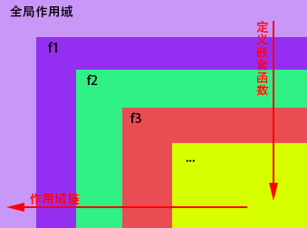

 <!-- MarkdownTOC -->

 - [函数的声明和调用](#%E5%87%BD%E6%95%B0%E7%9A%84%E5%A3%B0%E6%98%8E%E5%92%8C%E8%B0%83%E7%94%A8)
 - [变量声明提前](#%E5%8F%98%E9%87%8F%E5%A3%B0%E6%98%8E%E6%8F%90%E5%89%8D)
 - [不同函数定义方式的区别](#%E4%B8%8D%E5%90%8C%E5%87%BD%E6%95%B0%E5%AE%9A%E4%B9%89%E6%96%B9%E5%BC%8F%E7%9A%84%E5%8C%BA%E5%88%AB)
 - [词法作用域](#%E8%AF%8D%E6%B3%95%E4%BD%9C%E7%94%A8%E5%9F%9F)
 - [回调函数](#%E5%9B%9E%E8%B0%83%E5%87%BD%E6%95%B0)
 - [闭包](#%E9%97%AD%E5%8C%85)
   - [构成闭包一下几个必要条件](#%E6%9E%84%E6%88%90%E9%97%AD%E5%8C%85%E4%B8%80%E4%B8%8B%E5%87%A0%E4%B8%AA%E5%BF%85%E8%A6%81%E6%9D%A1%E4%BB%B6)
   - [闭包的优缺点](#%E9%97%AD%E5%8C%85%E7%9A%84%E4%BC%98%E7%BC%BA%E7%82%B9)
   - [为什么有闭包](#%E4%B8%BA%E4%BB%80%E4%B9%88%E6%9C%89%E9%97%AD%E5%8C%85)
 - [迭代器](#%E8%BF%AD%E4%BB%A3%E5%99%A8)
 - [箭头函数](#%E7%AE%AD%E5%A4%B4%E5%87%BD%E6%95%B0)
 - [典型实例](#%E5%85%B8%E5%9E%8B%E5%AE%9E%E4%BE%8B)
 - [Curry化](#curry%E5%8C%96)

 <!-- /MarkdownTOC -->

 闭包是js中一个极为NB的武器，但也不折不扣的成了初学者的难点。因为学好闭包就要学好作用域，正确理解作用域链，然而想做到这一点就要深入的理解函数，所以我们从函数说起。

### 函数的声明和调用

 首先说明一下，本文基于原生js环境，不涉及DOM部分
 最基本的就是函数的定义和调用，注意区分以下形式：
 ```javascript
 //以2下个是函数的定义
 function func(){  //函数声明
   /*code*/
 }
 var func = function(){   //函数表达式
   /*code*/
 };

 //以下2个是函数的调用（执行）
 func(); //无法得到函数的返回值
 var returnValue = func();  //执行函数并将返回值赋给returnValue, 如果函数没有指定返回值，返回undefined

 //以下2各定义了立即执行函数
 (function(){
   /*code*/
 })();
 (function(){
   /*code*/
 }());
 ```
 立即执行函数直接声明一个匿名函数，立即使用，省得定义一个用一次就不用的函数，而且免了命名冲突的问题。如果写为如下形式可获得立即执行函数的返回值。
 ```javascript
 var returnValue = (function(){return 1;}());
 var returnValue = (function(){return 1;})();
 ```
 除此之外，函数还有一种非常常见的调用方式——回调函数。将一个函数作为参数传入另一个函数，并在这个函数内执行。比如下面这个形式
 ```javascript
 document.addEventListener("click", console.log, false);
 ```
 理解了上面的部分，我们看一个典型的例子，好好理解一下函数的定义和调用的关系，这个一定要分清。下面这段代码很具有代表性：
 ``` javascript
 var arr = [];
 for(var i = 0; i < 10; i++){
     arr[i] = function(){
     return i;
   };
 }
 for(var j = 0; j < arr.length; j++){
   console.log(arr[j]() + " ");
 }  //得到输出：10 10 10 10 10 10 10 10 10 10
 ```
 我们需要理解这里面第一个for循环其实相当于如下形式，它只是定义了10个函数，并把函数放在数组中,并没有执行函数。由于js遵循词法作用域(lexical scoping), i是一个全局变量，所以第二个for循环调用函数的时候，i等于10
 ``` javascript
 var i = 0;
 arr[0] = function(){ return i; }; i++;
 arr[1] = function(){ return i; }; i++;
 arr[2] = function(){ return i; }; i++;
 //......省略
 arr[9] = function(){ return i; }; i++;
 //此时i == 10 循环结束
 ```
 再讲完了闭包我们再回来解决这个问题。

 关于函数的参数传递这里就不多说了，值得强调的是，上述2种定义函数的方式是有区别的，想理解这个区别，先要理解声明提前。

### 变量声明提前
 这个地方简单理解一下js的预处理过程。js代码会在执行前进行预处理，预处理的时候会进行变量声明提前，每个作用域的变量（用var声明的变量，没有用var声明的变量不会提前）和函数定义会提前到这个作用域内的开头。
 函数中的变量声明会提前到函数的开始，但初始化不会。比如下面这个代码。因此我们应该避免在函数中间声明变量，以增加代吗的可读性。
 ```javascript
 function(){
   console.log(a);  //undefined
   f();  //f called
   /*...*/
   function f(){
     console.log("f called");
   }
   var a = 3;
   console.log(a);  //3
 }
 ```
 这段代码等于(并且浏览器也是这么做的)：
 ```javascript
 function(){
   function f(){
     console.log("f called");
   }
   var a;
   console.log(a);  //undefined
   f();  //f called
   /*...*/
   a = 3;
   console.log(a);  //3
 }
 ```

### 不同函数定义方式的区别

 第一个区别：
 ```javascript
 function big(){
   func();//函数正常执行
   func1();//TypeError: func1 is not a function
   function func(){  //这个函数声明会被提前
     console.log("func is called");
   }
   var func1 = function(){  //这个函数声明会被提前，但不是个函数，而是变量
     console.log("func1 is called");
   };
 }
 big();
 ```
 第二个区别，比较下面2段代码
 ```javascript
 function f() {
   var b=function(){return 1;};
   function b(){return 0;};
   console.log(b());

   console.log(a());
   function a(){return 0;};
   var a=function(){return 1;};
 }
 f();
 ```
 不难发现，用表达式定义的函数可以覆盖函数声明直接定义的函数；但是函数声明定义的函数却不能覆盖表达式定义的函数。
 实际中我们发现，定义在调用之前`var f = function(){};`会覆盖`function f(){}`,而定义在调用之后`function f(){}`会覆盖`var f = function(){};`(你可以以不同顺序组合交换上面代码中的行，验证这个结论）

 第三个区别，其实这个算不上区别
 ```javascript
 var fun = function fun1(){
   //内部可见：fun和fun1
   console.log(fun1 === fun);
 };
 //外部仅fun可见
 fun();  //true 说明这是同一个对象的2各不同引用
 fun1(); //ReferenceError: fun1 is not defined
 ```
 此外还有一个定义方法如下：
 ```
 var func = new Function("alert('hello')");
 ```
 这个方式不常用，也不建议使用。因为它定义的函数都是在window中的，更严重的是，这里的代码实在`eval()`中解析的，这使得这个方式很糟糕，会带来性能下降和安全风险。具体就不赘述了。

### 词法作用域

 C++和Java等语言使用的都是块级作用域，js与它们不同，遵循词法作用域(lexical scoping)。讲的通俗一些，就是函数定义决定变量的作用域，函数内是一部分，函数外是另一部分，内部可以访问外部的变量，但外部无法直接访问内部的变量。首先我们看下面这个代码
 ``` javascript
 //这里是全局作用域
 var a = 3;
 var b = 2;
 var c = 20;
 function f(){ //这里是一个局部作用域
   var a = 12; //这是一个局部变量
   b = 10; //覆盖了全局变量
   var d = e = 15;   //只有第一参数d是局部变量，后面的都是全局变量
   f = 13; //新的全局变量
   console.log(a + " " + b + " " + d);
 }
 f(); //12 10 15
 console.log(a);  //3
 console.log(b);  //10
 console.log(c);  //20
 console.log(d);  //undefined
 console.log(e);  //15
 console.log(f);  //13
 ```
 <small>注：原生js在没有定使用义的变量时会得到undefined，并在使用过程中遵循隐式类型转换，但现在的浏览器不会这样，它们会直接报错。不过在函数中使用滞后定义的变量依然是undefined，不会报错，这里遵循声明提前的原则。</small>

 这是一个最基本的作用域模型。我们上文提到过，函数里面可以访问外面的变量，函数外部不能直接访问内部的变量.
 我们再看一个复杂一点的：
 ``` javascript
 var g = "g";
 function f1(a){
   var b = "f1";
   function f2(){
     var c = "f2";
     console.log(a + b + c + g);
   }
   f2();
 }
 f1("g"); //gf1f2g
 ```
 在js中，函数里面定义函数十分普遍，这就需要我们十分了解作用域链。
 如下这个代码定义了下图中的作用域链：
 ```javascript
 var g = 10;
 function f1(){
   var f_1 = "f1";
   function f2(){
     var f_2 = "f2";
     function f3(){
       var f_3 = "f3";
       /*function f...*/
     }
   }
 }
 ```

 

 这里内层的函数可以由内向外查找外层的变量(或函数)，当找到相应的变量(或函数)立即停止向外查找，并使用改变量(或函数)。而外层的函数不能访问内层的变量(或函数)，这样的层层嵌套就形成了作用域链。

 值得一提的是，函数的参数在作用于上相当于在函数内部第一行就声明了的变量，注意这里指的仅仅是声明，但不一定完成初始化，也就说明参数在没有传入值的时候值为undefined。

### 回调函数

 那么问题来了，在一个函数外部永远不能访问函数内部的变量吗？答案是否定的，我们可以用回调函数实现这个过程：
 ```javascript
 function A(arg){
   console.log(arg);
 }
 function B(fun){
   var a = "i am in function B";
   var i = 10;
   fun(a);
 }

 B(A); //i am in function B
 ```
 上面这个过程对于B而言，只把自己内部的变量a给了fun，而外部的A无论如何也访问不到B中的i变量，也就是说传入的fun函数只能访问B想让它访问的变量，因此回调函数这样的设计可以在代码的隔离和开放中间取得一个极好的平衡。
 说句题外话：javascript特别适用于事件驱动编程，因为回调模式支持程序以异步方式运行。

 好了，如果上面的你都看懂了，那么可以开始看闭包了。

### 闭包

 闭包是指有权访问另一个函数作用域中的变量的函数，创建闭包的最常见的方式就是在一个函数内创建另一个函数，通过另一个函数访问这个函数的局部变量。闭包主要是为了区分私有和公有的方法和变量，类似于c++和java中对象的public成员和protected成员。

 **一言以蔽之：作用域的嵌套构成闭包！**

####  构成闭包以下几个必要条件
 1. 函数(作用域)嵌套函数
 2. 函数(作用域)内部可以引用外部的参数和变量
 3. 参数和变量不会被垃圾回收机制回收。可以查看: [内存管理与垃圾回收](https://github.com/faremax1992/repoForBlog/blob/master/Javascript/%E5%86%85%E5%AD%98%E7%AE%A1%E7%90%86%E4%B8%8E%E5%9E%83%E5%9C%BE%E5%9B%9E%E6%94%B6.md)

####  闭包的优缺点

 - 优点
 1. 希望一个变量长期驻扎在内存中（如同c++中static局部变量）
 2. 避免全局变量的污染
 3. 私有成员的存在

 - 缺点
 1. 闭包常驻内存，会增大内存使用量，大量使用影响程序性能。
 2. 使用不当很容易造成内存泄露。可以查看: [内存管理与垃圾回收](https://github.com/faremax1992/repoForBlog/blob/master/Javascript/%E5%86%85%E5%AD%98%E7%AE%A1%E7%90%86%E4%B8%8E%E5%9E%83%E5%9C%BE%E5%9B%9E%E6%94%B6.md)。

 一般函数执行完毕后，局部活动对象就被销毁，内存中仅仅保存全局作用域。**但闭包不会**！

####  为什么有闭包
 我们考虑实现一个局部变量调用并自加的过程：
 ```
 var a = 0;
 function fun(){
   return a++;
 }
 fun(); //返回0
 fun(); //返回1
 fun(); //返回2

 function func(){
   var a = 0;
   return a++;
 }
 func(); //返回0
 func(); //返回0
 func(); //返回0
 ```
 看了上面代码你会发现，当a是全局变量的时候可以实现，但a成为了局部变量就不行了，当然，必须是闭包才可以实现这个功能：
 ```
 var f = (function(){
   var a = 0;
   return function(){
     return a++;
   }
 })();
 f(); //返回0
 f(); //返回1
 f(); //返回2
 ```
 这样不仅实现了功能，还防止了可能的全局污染。

 上文举了在循环内定义函数访问循环变量的例子，可结果并不如意，得到了十个10，下面我们用闭包修改这个代码，使它可以产生0~9：
 ```javascript
 var arr = [];
 for(var i = 0; i < 10; i++){
     arr[i] = (function(i){
     return function(){
       return i;
     };
   })(i);
 }
 for(var j = 0; j < arr.length; j++){
   console.log(arr[j]());
 }//这样就可以得到0~9了
 ```
 当然还以其他的解决方法：
 ```
 //方法2
 var arr = [];
 for(var i = 0; i < 10; i++){
   arr[i] = console.log.bind(null, i);
 }
 for(var j = 0; j < arr.length; j++){
   console.log(arr[j]());

 //方法3
 var arr = [];
 for(let i = 0; i < 10; i++){
   arr[i] = function(){
     console.log(i);
   };
 }
 for(var j = 0; j < arr.length; j++){
   console.log(arr[j]());
 }//这样也可以得到0~9了
 ```
### 迭代器

 好了，是时候放松一下了，看看下面这个代码，这个会简单一些
 ``` javascript
 var inc = function(){
   var x = 0;
   return function(){
     console.log(x++);
   };
 };
 inc1 = inc();
 inc1();  //0
 inc1();  //1
 inc2 = inc();
 inc2();  //0
 inc2();  //1
 inc2 = null;  //内存回收
 inc2 = inc();
 inc2();  //0
 ```
 你会发现，inc返回了一个函数，这个函数是个累加器，它们可以独立工作互补影响。这个就是js中迭代器next()的实现原理。下面是一个简单的迭代器：
 ```
 //实现对数组遍历
 function iterator(arr){
   var num = 0;
   return {
     next: function(){
       if(num < arr.length)
         return arr[num++];
       else return null;
     }
   };
 }
 var a = [1,3,5,7,9];
 var it = iterator(a);
 var num = it.next()
 while(num !== null){
   console.log(num)
    num = it.next();
 }//依次输出1，3，5，7，9
 ```
 如果你学了ES6，那么你可以用现成的迭代器，就不用自定义迭代器了。
### 箭头函数

 箭头函数本身也是一个函数，具有自己的作用域。不过在箭头函数里面的this上下文同函数定义所在的上下文，具体可以看我的另一篇文章：[javascript中this详解](https://github.com/faremax1992/repoForBlog/blob/master/Javascript/this%E8%AF%A6%E8%A7%A3.md)

### 典型实例
 这个实例会涉及到对象的相关知识，如果不能完全理解，可以参考：[javascript中this详解](https://github.com/faremax1992/repoForBlog/blob/master/Javascript/this%E8%AF%A6%E8%A7%A3.md) 和 [javascript对象、类与原型链](https://github.com/faremax1992/repoForBlog/blob/master/Javascript/%E5%AF%B9%E8%B1%A1%E3%80%81%E7%B1%BB%E4%B8%8E%E5%8E%9F%E5%9E%8B%E9%93%BE.md)
 ```
 function Foo() {
     getName = function () { console.log (1); };
     return this;
 }
 Foo.getName = function () { console.log (2);};
 Foo.prototype.getName = function () { console.log (3);};
 var getName = function () { console.log (4);};
 function getName() { console.log (5);}

 //请写出以下输出结果：
 Foo.getName();     //2, 函数的静态方法，直接调用相关函数就可以了。
 getName();    //4, 变量函数定义在调用之前，成功完成初始化，覆盖函数声明方式定义的同名函数
 Foo().getName();   //1, 这里 Foo()返回的 this 是 window,在 Foo调用时，对全局的变量型函数 getName 重新定义了，所以得到1。
 getName();   //1, 上一句改变了全局的 getName 函数为 cosnole.log(1)
 new Foo.getName();   //2，无参数 new 运算比 . 运算低，所以先运行 Foo.getName，得到2
 new Foo().getName();   //3，有参数 new 运算和 . 运算同一等级，故从左到右，先运算 new Foo() 得到一个匿名对象，在该对象上调用 getName 函数得到3
 new new Foo().getName();    //3，同上，先得到匿名对象，然后将该对象的方法 getName 当做构造函数来调用，得到一个新对象，并输出3;
 ```

### Curry化

 Curry化技术是一种通过把多个参数填充到函数体中，实现将函数转换为一个新的经过简化的（使之接受的参数更少）函数的技术。当发现正在调用同一个函数时，并且传递的参数绝大多数都是相同的，那么用一个Curry化的函数是一个很好的选择.

 下面利用闭包实现一个curry化的加法函数

 ```javascript
 function add(x,y){
   if(x && y) return x + y;
   if(!x && !y) throw Error("Cannot calculate");
   return function(newx){
     return x + newx;
   };
 }
 add(3)(4); //7
 add(3, 4); //7
 var newAdd = add(5);
 newAdd(8); //13
 var add2000 = add(2000);
 add2000(100); //2100
 ```

