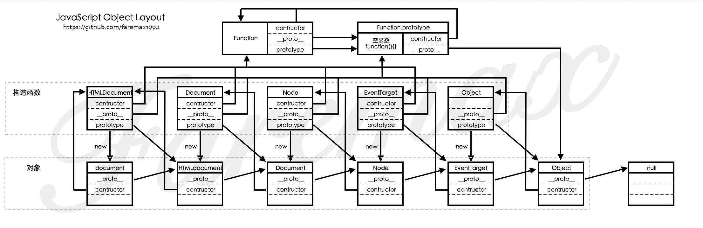
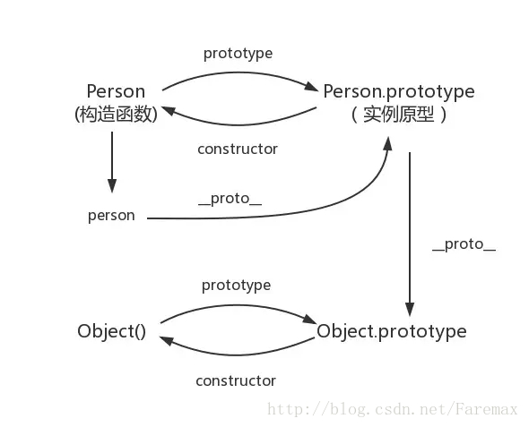

<!-- MarkdownTOC -->

- [对象的属性及属性特性](#%E5%AF%B9%E8%B1%A1%E7%9A%84%E5%B1%9E%E6%80%A7%E5%8F%8A%E5%B1%9E%E6%80%A7%E7%89%B9%E6%80%A7)
- [对象的特性](#%E5%AF%B9%E8%B1%A1%E7%9A%84%E7%89%B9%E6%80%A7)
  - [可扩展性](#%E5%8F%AF%E6%89%A9%E5%B1%95%E6%80%A7)
  - [密封性](#%E5%AF%86%E5%B0%81%E6%80%A7)
  - [冻结性](#%E5%86%BB%E7%BB%93%E6%80%A7)
  - [深冻结和浅冻结](#%E6%B7%B1%E5%86%BB%E7%BB%93%E5%92%8C%E6%B5%85%E5%86%BB%E7%BB%93)
- [构造函数\(Constructor\)](#%E6%9E%84%E9%80%A0%E5%87%BD%E6%95%B0constructor)
- [原型链与继承](#%E5%8E%9F%E5%9E%8B%E9%93%BE%E4%B8%8E%E7%BB%A7%E6%89%BF)
- [instanceof](#instanceof)
- [多态/重构](#%E5%A4%9A%E6%80%81%E9%87%8D%E6%9E%84)
  - [编译时多态](#%E7%BC%96%E8%AF%91%E6%97%B6%E5%A4%9A%E6%80%81)
  - [运行时多态](#%E8%BF%90%E8%A1%8C%E6%97%B6%E5%A4%9A%E6%80%81)
- [重写](#%E9%87%8D%E5%86%99)

<!-- /MarkdownTOC -->

js是一个基于对象的语言，所以本文研究一下js对象和类实现的过程和原理。

## 对象的属性及属性特性
下面是一个对象的各个部分：
```
var person = {
  name: "Lily",
  age: 10,
  work: function(){
    console.log("Lily is working...");
  }
};
person.gender = "F"; //可以动态添加属性
Object.defineProperty(person, "salary", {  //添加属性
  value: 10000,
  writable: true,  //是否可写，默认false
  enumerable: true,  //是否可枚举，默认false
  configuration: true  //是否可配置，默认false;
})；
Object.defineProperties(person, {  //添加多个属性
  "father": {
    value: Bob,
    enumerable: true
  },
  "mather": {
    value: Jelly,
    enumerable: true
  }
});
delete person.age; // 删除属性
Object.getOwnPropertyDescriptor(person, "father"); //{
value:10000,writable:true,enumerable:true,configuration:true}
```
是否可写指得是其值是否可修改；
是否可枚举指的是其值是否可以被for...in...遍历到；
是否可配置指的是其可写性，可枚举性，可配置性是否可修改，并且决定该属性可否被删除。

这是一个普通的对象和常见操作，不多说，下面是一个具有get/set的对象：
```
var person = {
  _age: 11,
  get age(){
    return this._age;
  },
  set age(val){
    this._age = val;
  }
};
//如下方法访问：
console.log(o.age); //读
o.age = 30;  //写
console.log(o.age);
```

## 对象的特性
上文，我们只提到了对象属性的4个性质，对象自己其实也有3个性质：

### 可扩展性
可不可扩展是指一个对象可不可以添加新的属性；Object.preventExtensions 可以让这个对象变的不可扩展。尝试给一个不可扩展对象添加新属性的操作将会失败，但不会有任何提示，(严格模式下会抛出TypeError异常)。Object.preventExtensions只能阻止一个对象不能再添加新的自身属性，仍然可以为该对象的原型添加属性，但__proto__属性的值也不能修改。
```
var person = {
  name: "Lily",
  age: 10
};    //新创建的对象默认是可扩展的
console.log(Object.isExtensible(person));  //true
person.salary = 10000;
console.log(person.salary)  //10000

Object.preventExtensions(person);//将其变为不可扩展对象
console.log(Object.isExtensible(person));   //false

person.height = 180; //失败,不抛出错误
console.log(person.height); //undefined

person.__proto__.height = 180; //在其原型链上添加属性
console.log(person.height); //180

delete person.age;   //可以删除已有属性
console.log(person.age);   //undefined
person.__proto__ = function a(){};  //报错TypeError: #<Object> is not extensible(…)

function fun(){
  'use strict'
  person.height = 180;  //报错TypeError: #<Object> is not extensible(…)
}
fun();

Object.defineProperty("height", {
  value: 180
});  //由于函数内部采用严格模式，所以报错TypeError: #<Object> is not extensible(…)
```
<small>这里如果不理解`__proto__`不要紧，下文会重点解释这个属性</small>
### 密封性
如果我们想让一个对象即不可扩展，又让它的所有属性不可配置，一个个修改属性的configurable太不现实了，我们把这样的对象叫做密封的(Sealed)。用Object.isSealed()判断一个对象是否密封的，用Object.seal()密封一个对象。 其特性包括不可扩展对象和不可配置属性的相关特性。
```
var person = {
  name: "Lily",
  age: 10
};    //新创建的对象默认是不密封的
console.log(Object.isSeal(person));  //false

Object.seal(person);//将其变为密封对象
console.log(Object.isSeal(person));   //true

delete person.age;   //无法删除已有属性，失败，不报错。但严格模式会报错
console.log(person.age);   //undefined
person.__proto__ = function a(){};  //报错TypeError: #<Object> is not extensible(...)
```
### 冻结性
此时，这个对象属性可能还是可写的，如果我们想让一个对象的属性既不可写也不可配置，同时让该对象不可扩展，那么就需要冻结这个对象。用Object.freeze()冻结对象，用isFrozen()判断对象是否被冻结。由于相比上一个例子，仅仅是现有的变得不可写了，这里就不举太多例子了。
不过值得注意的是，对于具有setter的属性一样不可写。
```
var person = {
  name: "Lily",
  _age: 10,
  get age(){
    return this._age;
  },
  set age(val){
    this._age = val;
  }
};    //新创建的对象默认不是冻结的
console.log(Object.isFrozen(person));  //false

Object.freeze(person);//将其变为不可扩展对象
console.log(Object.isExtensible(person));   //false
console.log(Object.isSealed(person));   //true
console.log(Object.isFrozen(person));   //true

console.log(person.name);  //"Lily"
person.name = "Bob"; //失败，但不报错，但严格模式会报错。
console.log(person.name);  //"Lily"

console.log(person.age);   //10
person.age = 30;
console.log(person.age);   //10
```
### 深冻结和浅冻结
深冻结和浅冻结的主要差异出现在可扩展性上，所以你也可以理解为深可扩展和浅可扩展。我们看一下以下代码：
```
var person = {
  addr: {}
}

Object.freeze(person);
person.addr.province = "Guangzhou"; //浅冻结：对象的属性对象可以继续扩展
console.log(person.addr.province); //"Guangzhou"
```
为了实现深冻结，我们写一个函数：
```
var person = {
  name: "nihao",
  addr: {},
  family:{
    slibing:{},
    parents:{}
  }
}

deepFreeze(person);
person.addr.province = "Guangzhou"; //深冻结：对象的属性对象无法继续扩展
console.log(person.addr.province); //undefined
person.family.parents.father = "Bob"; //深冻结：对象的属性对象无法继续扩展
console.log(person.family.parents.father); //undefined

function deepFreeze(obj){
  Object.freeze(obj);
  for(key in obj){
    if(!obj.hasOwnProperty(key)) continue;
    if(obj[key] !== Object(obj[key])) continue;
    deepFreeze(obj[key]);  //递归调用
  }
}
```
注意，这里递归没有判断链表是否成环，判断有环链表是数据结构的知识，可以使用一组快慢指针实现，这里不赘述。因此在以下情况会有一个bug：
```
function Person(pname, sname){
  this.name = pname || "";
  this.spouse = sname || {};
}
var p1 = new Person("Lily");
var p2 = new Person("Bob", p1);
p1.spouse = p2;
deepFreeze(p1);  //会陷入无休止的递归。实际家庭成员关系更复杂，就更糟糕了。RangeError: Maximum call stack size exceeded(…)
```

## 构造函数(Constructor)
当我们想创建很多个人的时候，就不会像上面这样一个一个写了。那我们就造一个工厂，用来生产人(感觉有点恐怖)：
```
function CreatePerson(pname, page){
  return {
    name: pname,
    age: page
  };
}
p1 = CreatePerson("Lily", 21);
p2 = CreatePerson("Bob", 12);

console.log(p1);  //Object {name: "Lily", age: 21}
console.log(p2);  //Object {name: "Bob", age: 12}
```
但是这样写并不符合传统的编程思路。因此我们需要一个构造函数(constructor, 也有书译为构造器)

关于构造函数和普通函数的区别可以看[javascript中this详解中”构造函数中的this"一节](https://github.com/faremax1992/repoForBlog/blob/master/Javascript/this%E8%AF%A6%E8%A7%A3.md#%E6%9E%84%E9%80%A0%E5%87%BD%E6%95%B0%E4%B8%AD%E7%9A%84this)
。
下面定义一个构造函数：
```
function Person(pname, page){
  this.name = pname;
  this.age = page;
  this.work = function(){
    console.log(this.name + " is working...");
  };
}
var p1 = new Person("Lily",23);
var p2 = new Person("Lucy", 21);
console.log(p1);
p1.work();
console.log(p2);
p2.work();
```
不过这样写这个函数，每个对象都会包括一部分，太浪费内存。所以我们会把公共的部分放在prototype中：
```
function Person(pname, page){
  this.name = pname;
  this.age = page;
}
Person.prototype.work = function(){
  console.log(this.name + " is working...");
};
var p1 = new Person("Lily",23);
var p2 = new Person("Lucy", 21);
console.log(p1);
p1.work();
console.log(p2);
p2.work();
```
通过上面的输出，我们看到，每个对象(p1,p2)都包含了一个`__proto__`属性，这个是一个非标准属性（ES6已经把它标准化了）,不过IE中没有这个属性。

## 原型链与继承
在学习原型链之前我们一定要区分清楚：**prototype是构造函数的属性，而`__proto__`是对象的属性。**当然我们依然用代码说话：

再来一段代码：
```
function Person(pname, page){
  this.name = pname;
  this.age = page;
}
Person.prototype.work = function(){
    console.log(this.name + " is working...");
  };

var p = new Person("Lily",23);
console.log(p.constructor);  //function Person(){...}
console.log(p.__proto__);  //Object

console.log(Person.prototype); //Object
console.log(Person.prototype.constructor);  //function Person(){...}

console.log(Person.__proto__);
console.log(Person.constructor);

console.log(Person.__proto__);  //空函数function(){}
console.log(Person.constructor);   //function Function(){...}
```

说到这里，就有必要学习一下原型链了。
js没有类的概念，这样就不会有继承派生和多态，但是实际编程中我们需要这样的结构，于是js在发展过程中，就从一个没有类的语言模拟出来类的效果，这里靠的就是prototype。
一个**构造函数的prototype永远指向他的父对象**，这样这个构造函数new出来的对象就可以访问其父对象的成员，实现了继承。
如果他的父对象的prototype又指向一个父对象的父对象，这样一层层就构成了原型链。如下(用浏览器内置对象模型举例)：
```
console.log(HTMLDocument);
console.log(HTMLDocument.prototype); //HTMLDocument对象
console.log(HTMLDocument.prototype.constructor.prototype);
console.log(HTMLDocument.prototype.constructor.prototype.constructor.prototype);
console.log(HTMLDocument.prototype.constructor.prototype.constructor.prototype.constructor.prototype);
console.log(HTMLDocument.prototype.constructor.prototype.constructor.prototype.constructor.prototype.constructor.prototype);
/*......*/
```
如果你觉得这里应该有一张图，那就看看这个完整的对象关系图（基于DOM），下文的相关例子也基于这个图：



注意：原型链是有穷的，他总会指向Object，然后是null结束

那么`__proto__`是什么？一言以蔽之:**对象的`__proto__`属性指向该对象构造函数的原型**。如下：
```
function Person(pname, page){
  this.name = pname;
  this.age = page;
  this.work = function(){
    console.log(this.name + " is working...");
  };
}
var o = new Person("Lily",23);
o.__proto__ === Person.prototype  //true
```
上面图中发现，对象还有一个constructor属性，这个属性也很重要，**新创建对象的constructor指向默认对象的构造函数本身**，不过现实没有这么简单。例如：
```
function Person(){
}
var p1 = new Person();
console.log(p1.constructor);  //function Person(){...}

function Children(){
}
Children.prototype = p1;//这一行和下一行联立使用，不能忽略下一行
Children.prototype.constructor = Children;  //修正constructor，这个不能省略

console.log(Person.prototype.constructor);  //function Person(){...}

console.log(p1.constructor); //function Child(){...}
```
当我们建立了一个继承关系后，会使新的构造函数的prototype.constructor指向改构造函数自己，像上面第9行一样。从第11行也可以看出，系统本身也是这样做的。这样就构成了下面这个图的关系，此时**父对象的constructor指向子构造函数**：


<small>注: 图片来自网络</small>

从上面的这些例子我们不难发现，函数也是一个对象。因此构造函数也有了constructor和__proto__属性。不过这里会比较简单：**函数的constructor都是Function(){...};函数的`__proto__`都是个空函数**

其实在js中除了基本类型(null, undefined, String, Number, Boolean, Symbol)以外，都是对象。可能你想反驳我：“js中一切都是对象”。我们看以下几个例子：
```
//以数字类型为例
var a = 1;   //基本类型
console.log(a);  //1
console.log(typeof a);  //number
var b = new Number(1);  //对象类型的数字
console.log(b);   //Number {[[PrimitiveValue]]: 1}
console.log(typeof b);  //object
```
首先，js中基本类型中除了null和undefined以外的类型，都具有对象形式。但对象形式不等于基本类型。从上面的输出结果来看，var a = 1;和var a = new Number(1);完全不是一回事。你或许会反驳我:"a有方法呀,基本类型怎么会有方法！！",我们再看下一个例子:
```
var a = 1;
console.log(a.toFixed(2));  //1.00
var b = new Number(1);
console.log(b + 2);  //3
```
上面的例子看似基本类型a有了方法，对象又可以参与运算。实际上这是隐式类型转换的结果，上面第二行，浏览器自动调用了new Number()把a转换成了对象，而第四行利用ValueOf()方法把对象转换成了数字。

既然函数也是个对象，那么我们不仅可以用构造函数new一个对象出来，也可以为它定义私有方法(变量)和静态方法
```
function Person(pname){
  var age = 10; //私有变量，外面访问不到
  function getAge(){  //私有方法，外面访问不到
    console.log(age);
  }
  this.name = pname;
  this.getInfo = function(){  //公有方法，也可以定义在prototype中
    console.log(this.name);
    getAge.call(this);  //注意这里的作用域和调用方式
  };
};
Person.speak = function(){console.log("I am a person");};  //静态方法

var p = new Person("Bob");
p.getInfo();    //Bob 10

Person.speak();    //"I am a person"
```

当然实现简单的对象继承不用这么复杂，可以使用Object.create(obj);返回一个继承与obj的对象。对与Object.create()方法需要考虑一下几种情况:
```
var o = {};
var r1 = Object.create(o);  //创建一个r1继承于o
var r2 = Object.create(null);  //创建一个r2继承于null
var r3 = Object.create(Object);   //创建一个r3继承于Object
console.log(r1); //是一个继承自o的对象
console.log(r2); //是一个空对象，没有__proto__属性
console.log(r3); //是一个函数
```
有了先前的知识，我们可以写出来一个函数实现Object.create()
```
function inherit(o){
  //if(Object.create) return Object.create(o);
  if(o !== Object(o) && o !== null)  throw TypeError("Object prototype may only be an Object or null");
  function newObj(){};
  newObj.prototype = o || {};
  var result = new newObj();
  if(o === null) result.__proto__ = null;
  return result;
}
var obj = {};
console.log(Object.create(obj));
console.log(inherit(obj));
console.log(Object.create(null));
console.log(inherit(null));
console.log(Object.create(Object));
console.log(inherit(Object));
```
看了这么多，怎么写继承比较合理，我们实现2个构造函数，让Coder继承Person。比较以下3种方法：
```
function Person(pname){
  this.name = pname;
}
function Coder(){}

//方法一：共享原型
Coder.prototype = Person.prototype;

//方法二：实例继承
Coder.prototype = new Person("Lily");
Coder.prototype.constructor = Coder;

//方法三：本质上还是实例继承
Coder.prototype = Object.create(Person.prototype);
```
当然还有其他的继承方法：
```
//方法4：构造继承
function Person(pname){
  this.name = pname;
}
function Coder(pname){
  Person.apply(this, argument);
}

//方法5：复制继承
function Person(pname){
  this.name = pname;
  this.work = function() {...};
}
var coder = deepCopy(new Person()); //拷贝
coder.code = function(){...};  //扩展新方法
coder.language = "javascript";  //扩展新属性
coder.work = function() {...};  //重构方法

//下面是深拷贝函数
function deepCopy(obj){
    var obj = obj || {};
    var newObj = {};
    deeply(obj, newObj);

    function deeply(oldOne, newOne){
        for(var prop in oldOne){
            if(!oldOne.hasOwnProperty(prop)) continue;
            if(typeof oldOne[prop] === "object" && oldOne[prop] !== null){
                newOne[prop] = oldOne[prop].constructor === Array ? [] : {};
                deeply(oldOne[prop], newOne[prop]);
            }
            else
                newOne[prop] = oldOne[prop];
        }
    }
    return newObj;
}
```
既然方法这么多，我们该如和选择，一张表解释其中的区别
--- | 共享原型 | 实例继承 | 构造继承 | 复制继承
---|--- | --- | --- | ---
原型属性 | 继承 | 继承 | 不继承 | 继承
本地成员 | 不继承 | 继承 | 继承 | 继承
子类影响父类 | Y | N | N | N
执行效率 | 高 | 高 | 高 | 低
多继承 | N | N | Y | Y
obj instanceof Parent | true | false | false | false

**子类的修改会影响父类是绝对不行的，所以共享原型是不能用的。在考虑到使用方便，只要不涉及多继承就用实例继承，多继承中构造继承也好于复制继承。**

## instanceof
instanceof用来判断对象是否某个构造函数的实例。这个东西很简单，不仅可以判断是否直接构造函数实例，还能判断是否父对象构造函数的实例
```
function Person(){}

var p = new Person();

console.log(p instanceof Person); //true
console.log(p instanceof Object); //true

```

## 多态/重构
js的方法名不能相同，我们只能模拟实现类似c++一样的多态。

### 编译时多态
注意：这个名字只是用了强类型语言的说法，**js是个解释型语言，没用编译过程**。

在方法内部判断参数情况进行重载
1. 参数数量不同做不同的事情
```
//修改字体，仅用部分属性举例：
function changeFont(obj, color, size, style){
  if(arguments.lenght === 4){
    //当传入了参数为4个参数时候做的事情
    obj.style.fontSize = size;
    obj.style.fontColor = color;
    obj.style.fontStyle = style;
    return;
  }
  if(arguments.length === 2 && typeof arguments[1] === "object"){
    //当传入了参数为2个参数时候做的事情
    obj.style.fontSize = arguments[1].size || obj.style.fontSize;
    obj.style.fontStyle = arguments[1].style || obj.style.fontStyle;
    obj.style.fontColor = arguments[1].color || obj.style.fontColor;
    return;
  }
  throw TypeError("the font cannot be changed...");
}
```
2. 参数类型不同做不同的事情
```
//构造简单对象
function toObject(val){
  if(val === Object(val)) return val;
  if(val == null) throw TypeError("'null' and 'undefined' cannot be an Object...");
  switch(typeof val){
    case "number": return new Number(val);
    case "string": return new String(val);
    case "boolean": return new Boolean(val);
    case "symbol": return new Symbol(val);
    default: throw TypeError("Unknow type inputted...");
  }
}
```
### 运行时多态
java的多态都是编译时多态。所以这个概念是源于c++的，c++利用虚基类实现运行过程中同一段代码调用不同的函数的效果。而在js中可以利用函数传递实现运行时多态
```
function demo(fun, obj){
  obj = obj || window;
  fun.call(this);
}

function func(){
  console.log("I'm coding in " + this.lang);
}

var lang = "C++";
var o = {
  lang: "JavaScript",
  func: function(){
    console.log("I'm coding in " + this.lang);
  }
};

demo(func);
demo(o.func);
demo(func, o);
```

## 重写

我们都知道子对象可以重写父对象中的函数，这样子对象函数对在子对象中替代父对象的同名函数。但如果我们希望既在子对象中重写父类函数，有想使用父类同名函数怎么办！分一下几个情况讨论：
```
//情况1
function Person(){
  this.doing = function(){
    console.log("I'm working...");
  };
}
function Coder(){
  Person.call(this);
  var ParentDoing = this.doing;
  this.doing = function(){
    console.log("My job is coding...");
    ParentDoing();
  }
}
var coder = new Coder();
coder.doing();  //测试


//情况2
function Person(){
}
Person.prototype.doing = function(){
  console.log("I'm working...");
};
function Coder(){
  Person.call(this);
  this.doing = function(){
    console.log("My job is coding...");
    Person.prototype.doing.call(this);
  };
}
var coder = new Coder();
coder.doing();  //测试

//情况3
function Person(){
}
Person.prototype.doing = function(){
  console.log("I'm working...");
};
function Coder(){
}
Coder.prototype = Object.create(Person.prototype);
Coder.prototype.constructor = Coder;
Coder.super = Person.prototype;
Coder.prototype.doing = function(){
  console.log("My job is coding...");
  Coder.super.doing();
};
var coder = new Coder();
coder.doing();  //测试
```
