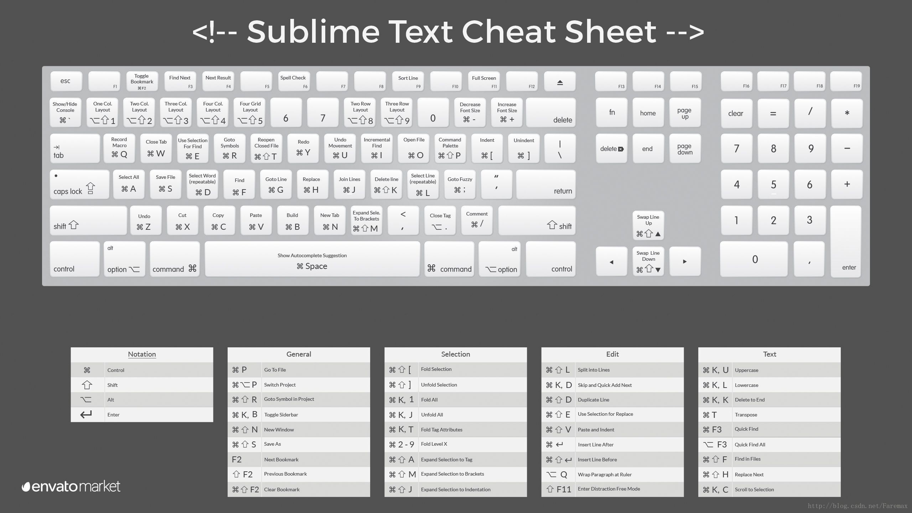

> 本文一览针对 Sublime 3 , 使用前一版可能会有少许不同。文末附了一张网络上的图，图中的键位是 Sublime 2 的，仅供参考。

<!-- MarkdownTOC -->

- [文件操作](#%E6%96%87%E4%BB%B6%E6%93%8D%E4%BD%9C)
- [文本编辑](#%E6%96%87%E6%9C%AC%E7%BC%96%E8%BE%91)
- [光标、选区操作](#%E5%85%89%E6%A0%87%E3%80%81%E9%80%89%E5%8C%BA%E6%93%8D%E4%BD%9C)
- [查找替换操作](#%E6%9F%A5%E6%89%BE%E6%9B%BF%E6%8D%A2%E6%93%8D%E4%BD%9C)
- [窗口操作](#%E7%AA%97%E5%8F%A3%E6%93%8D%E4%BD%9C)
- [跳转操作](#%E8%B7%B3%E8%BD%AC%E6%93%8D%E4%BD%9C)

<!-- /MarkdownTOC -->

### 文件操作

mac快捷键 | win/linux快捷键 | 功能描述
--- | --- | ---
`⌘N` | `ctrl + N` | 新建文件
`⌘O` | `ctrl + O` | 打开文件
`⌘S` | `ctrl + S` | 保存文件
`⌘⇧S` | `ctrl + shift + S` | 另存文件
`⌘⌥S` | --- | 保存全部文件
`⌘W` | `Ctrl + W` | 关闭当前文件

### 文本编辑

mac快捷键 | win/linux快捷键 | 功能描述
--- | --- | ---
`⌘A` | `ctrl + A` | 全选
`⌘C` | `ctrl + C` | 复制
`⌘X` | `ctrl + X` | 剪切
`⌘V` | `ctrl + V` | 粘贴
`⌘/` | `ctrl + /` | 注释
`⌘⌥/` | `ctrl + shift + /` | 块注释
`⌘Z` | `ctrl + Z` | 撤销
`⌘Y` | `ctrl + Y` | 恢复撤销
`⌘⇧↩` | `Ctrl + Shift + Enter` | 在当前行前插入新行
`⌘↩` | `Ctrl + Enter` | 在当前行后插入新行
`^⇧K` | `Ctrl + Shift + K` | 删除行
`⌘⇧D` | `Ctrl + Shift + D` | 复制(多)行
`⌘J` | `ctrl + J` | 合并(多)行
`⌘KK` | `Ctrl + K + K` | 从光标处删至除行尾
`⌘K⌫` |  | 从光标处删除至行首
`⌘KU` | `ctrl + K + U` | 改为大写
`⌘KL` | `ctrl + K + L` | 改为小写
`⌘⇧V` | `Ctrl + Shift + V` | 粘贴并自动缩进
`⌘⌥V` | `Ctrl + K + V` | 从历史中选择粘贴
`⌘]` | `tab` | 向右缩进
`⌘[` | `shift + tab` | 向左缩进
`⌘^↑/↓` | `Ctrl + shift + ↑/↓` | 交换2行位置
`⌘⌥]` | `Ctrl + shift + ]` | 展开标签
`⌘⌥[` | `Ctrl + shift + [` | 折叠关闭标签
`⌘⌥KJ` | `Ctrl + K + J` | 展开全部标签
`⌘⌥KT` | `Ctrl + K + T` | 折叠标签属性
`⌘⌥Kn` | `Ctrl + K + n` | 折叠第n级标签

### 光标、选区操作

mac快捷键 | win/linux快捷键 | 功能描述
--- | --- | ---
`⌘U` | `ctrl + U` | 软撤销(可撤销光标移动)
`⌘⇧U` | `ctrl + shift + U` | 软重做(可重做光标移动)
`⌘L` | `ctrl + L` | 选择行(重复按下将下一行加入选择)
`⌘D` | `Ctrl + D` | 选择词(重复按下时多重选择相同的词进行多重编辑)
`⇧↑/↓` | `shift + ↑/↓` | 向上/下选中多行。
`⇧←/→` | `Shift + ←/→` | 向左/右选中文本。
`^⇧M` | `ctrl + shift + M` | 扩展选区至对应的括号
`^⇧A` | `ctrl + shift + A` | 扩展选区至对应的标签
`^⇧A` | `ctrl + shift + Space` | 扩展选区至对应的作用域
`^⇧↑/↓` | `ctrl + ↑/↓` | 扩展选区至文件开头/结尾。
`⌘⇧L` | `Ctrl + Shift + L` | 将选区转换成多个单行选区
`^⇧←/→` | `Ctrl + Shift + ←/→` | 向左/右单位性地选中文本。
`^-` | `ctrl + -` | 光标跳回上一个位置
`^⇧-` | `ctrl + shift + -` | 光标恢复位置
`⌥←/→` | `Ctrl + ←/→ `| 向左单位性地移动光标，快速移动光标。
`⌘⇧↑/↓` | `Ctrl + Alt + ↑/↓` | 向上/下添加多行光标，可同时编辑多行。

### 查找替换操作

mac快捷键 | win/linux快捷键 | 功能描述
--- | --- | ---
`⌘f` | `ctrl + f` | 查找
`⌘⌥f` | `chrl + h` | 查找并替换
`⌘⌥g` | --- | 查找下一个符合当前所选的内容
`⌘^g` | --- | 查找所有符合当前选择的内容进行多重编辑
`⌘⇧F` | `ctrl + shift + f` | 在所有打开的文件中进行查找

### 窗口操作

mac快捷键 | win/linux快捷键 | 功能描述
--- | --- | ---
`⌘⇧N` | `Ctrl + Shift + N` |打开一个新的sublime窗口
`⌘⇧W` | `Ctrl + Shift + W` | 关闭窗口
`⌘^F` | `F11` | 全屏
`⌘⇧^F` | `Shift+F11` | 全屏免打扰模式，只编辑当前文件
`⌘⌥[1,2,3,4,5,8,9]` | `Alt + Shift + [1,2,3,4,5]` | 拆分窗口为：单列、双列、三列、四列、网格、双行、三行
`^[1,2,3,4]` | `ctrl + [1,2,3,4]` | 焦点移动到相应的组(分屏编号)
`^⇧[1,2,3,4]` | `ctrl + shift + [1,2,3,4]` | 将当前文件移动到相应的组(分屏编号)

### 跳转操作

mac快捷键 | win/linux快捷键 | 功能描述
--- | --- | ---
`⌘[1,2,3,4]` | `alt + [1,2,3,4]` | 选择相应的标签页
`^Tab` | `ctrl + tab` | 向后切换窗口内打开的文件
`^⇧Tab` | `ctrl + shift + tab` | 向后切换窗口内打开的文件
`⌘P` | `ctrl + P` | 跳转到一切
`⌘T` | --- | 前往文件
`⌘^P` | --- | 前往项目
`⌘R` | `ctrl + R` | 前往符号
`⌘⇧P` | `ctrl + shift + P` | 前往符号项目内符号
`^G` | `ctrl + G` | 前往行
`^-` | `Alt + G` | 后退
`^⇧-` | `Alt + shift + G` | 前进
`⌘KB` | `Ctrl + K + B` | 开关侧栏
`^~` | `ctrl + ~` | 打开控制台
`Esc` | `Esc` | 退出光标多行选择，退出搜索框，命令框等。
`^M` | `ctrl + M` | 跳转至对应的括号

最后附一张网上找到的图，亲测发现有少数键不同于 Sublime 3：

